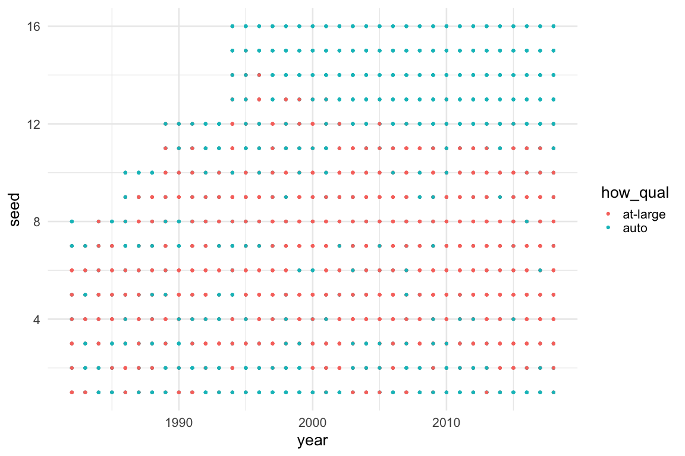

Tidy Tuesday Exploration 2020-10-06
================
Sara Stoudt
10/7/2020

Original data (with codebook)
[here](Data%20here:%20https://github.com/rfordatascience/tidytuesday/blob/master/data/2020/2020-10-06/readme.md).

``` r
library(dplyr)
library(ggplot2)
library(purrr)
library(kableExtra)
setwd("~/Desktop/tidytuesday/data/2020/2020-10-06")

data <- read.csv("tournament.csv", stringsAsFactors = F)
```

### Who are the best teams in 2018?

``` r
topTeams <- data %>%
  filter(year == 2018) %>%
  arrange(desc(reg_w)) %>%
  head(5)

kable(topTeams)
```

<table>

<thead>

<tr>

<th style="text-align:right;">

year

</th>

<th style="text-align:left;">

school

</th>

<th style="text-align:right;">

seed

</th>

<th style="text-align:left;">

conference

</th>

<th style="text-align:right;">

conf\_w

</th>

<th style="text-align:right;">

conf\_l

</th>

<th style="text-align:right;">

conf\_percent

</th>

<th style="text-align:left;">

conf\_place

</th>

<th style="text-align:right;">

reg\_w

</th>

<th style="text-align:right;">

reg\_l

</th>

<th style="text-align:right;">

reg\_percent

</th>

<th style="text-align:left;">

how\_qual

</th>

<th style="text-align:left;">

x1st\_game\_at\_home

</th>

<th style="text-align:right;">

tourney\_w

</th>

<th style="text-align:right;">

tourney\_l

</th>

<th style="text-align:left;">

tourney\_finish

</th>

<th style="text-align:right;">

full\_w

</th>

<th style="text-align:right;">

full\_l

</th>

<th style="text-align:right;">

full\_percent

</th>

</tr>

</thead>

<tbody>

<tr>

<td style="text-align:right;">

2018

</td>

<td style="text-align:left;">

Louisville

</td>

<td style="text-align:right;">

1

</td>

<td style="text-align:left;">

Atlantic Coast

</td>

<td style="text-align:right;">

15

</td>

<td style="text-align:right;">

1

</td>

<td style="text-align:right;">

93.8

</td>

<td style="text-align:left;">

T1st

</td>

<td style="text-align:right;">

32

</td>

<td style="text-align:right;">

2

</td>

<td style="text-align:right;">

94.1

</td>

<td style="text-align:left;">

auto

</td>

<td style="text-align:left;">

Y

</td>

<td style="text-align:right;">

4

</td>

<td style="text-align:right;">

1

</td>

<td style="text-align:left;">

NSF

</td>

<td style="text-align:right;">

36

</td>

<td style="text-align:right;">

3

</td>

<td style="text-align:right;">

92.3

</td>

</tr>

<tr>

<td style="text-align:right;">

2018

</td>

<td style="text-align:left;">

Mississippi St.

</td>

<td style="text-align:right;">

1

</td>

<td style="text-align:left;">

Southeastern

</td>

<td style="text-align:right;">

16

</td>

<td style="text-align:right;">

0

</td>

<td style="text-align:right;">

100.0

</td>

<td style="text-align:left;">

1st

</td>

<td style="text-align:right;">

32

</td>

<td style="text-align:right;">

1

</td>

<td style="text-align:right;">

97.0

</td>

<td style="text-align:left;">

at-large

</td>

<td style="text-align:left;">

Y

</td>

<td style="text-align:right;">

5

</td>

<td style="text-align:right;">

1

</td>

<td style="text-align:left;">

N2nd

</td>

<td style="text-align:right;">

37

</td>

<td style="text-align:right;">

2

</td>

<td style="text-align:right;">

94.9

</td>

</tr>

<tr>

<td style="text-align:right;">

2018

</td>

<td style="text-align:left;">

UConn

</td>

<td style="text-align:right;">

1

</td>

<td style="text-align:left;">

American Athletic

</td>

<td style="text-align:right;">

16

</td>

<td style="text-align:right;">

0

</td>

<td style="text-align:right;">

100.0

</td>

<td style="text-align:left;">

1st

</td>

<td style="text-align:right;">

32

</td>

<td style="text-align:right;">

0

</td>

<td style="text-align:right;">

100.0

</td>

<td style="text-align:left;">

auto

</td>

<td style="text-align:left;">

Y

</td>

<td style="text-align:right;">

4

</td>

<td style="text-align:right;">

1

</td>

<td style="text-align:left;">

NSF

</td>

<td style="text-align:right;">

36

</td>

<td style="text-align:right;">

1

</td>

<td style="text-align:right;">

97.3

</td>

</tr>

<tr>

<td style="text-align:right;">

2018

</td>

<td style="text-align:left;">

Baylor

</td>

<td style="text-align:right;">

2

</td>

<td style="text-align:left;">

Big 12

</td>

<td style="text-align:right;">

18

</td>

<td style="text-align:right;">

0

</td>

<td style="text-align:right;">

100.0

</td>

<td style="text-align:left;">

1st

</td>

<td style="text-align:right;">

31

</td>

<td style="text-align:right;">

1

</td>

<td style="text-align:right;">

96.9

</td>

<td style="text-align:left;">

auto

</td>

<td style="text-align:left;">

Y

</td>

<td style="text-align:right;">

2

</td>

<td style="text-align:right;">

1

</td>

<td style="text-align:left;">

RSF

</td>

<td style="text-align:right;">

33

</td>

<td style="text-align:right;">

2

</td>

<td style="text-align:right;">

94.3

</td>

</tr>

<tr>

<td style="text-align:right;">

2018

</td>

<td style="text-align:left;">

Belmont

</td>

<td style="text-align:right;">

12

</td>

<td style="text-align:left;">

Ohio Valley

</td>

<td style="text-align:right;">

18

</td>

<td style="text-align:right;">

0

</td>

<td style="text-align:right;">

100.0

</td>

<td style="text-align:left;">

1st
Div.

</td>

<td style="text-align:right;">

31

</td>

<td style="text-align:right;">

3

</td>

<td style="text-align:right;">

91.2

</td>

<td style="text-align:left;">

auto

</td>

<td style="text-align:left;">

N

</td>

<td style="text-align:right;">

0

</td>

<td style="text-align:right;">

1

</td>

<td style="text-align:left;">

1st

</td>

<td style="text-align:right;">

31

</td>

<td style="text-align:right;">

4

</td>

<td style="text-align:right;">

88.6

</td>

</tr>

</tbody>

</table>

### Have they gotten better/worse/stayed the same over time?

``` r
ggplot(subset(data, school %in% topTeams$school), aes(year, reg_percent, col = school, group = school)) + geom_point() + geom_line() + theme_minimal(base_size = 20)
```

<!-- -->

### What about the best teams in 1990?

``` r
topTeamsOld <- data %>%
  filter(year == 1990) %>%
  arrange(desc(reg_w)) %>%
  head(5)

kable(topTeams)
```

<table>

<thead>

<tr>

<th style="text-align:right;">

year

</th>

<th style="text-align:left;">

school

</th>

<th style="text-align:right;">

seed

</th>

<th style="text-align:left;">

conference

</th>

<th style="text-align:right;">

conf\_w

</th>

<th style="text-align:right;">

conf\_l

</th>

<th style="text-align:right;">

conf\_percent

</th>

<th style="text-align:left;">

conf\_place

</th>

<th style="text-align:right;">

reg\_w

</th>

<th style="text-align:right;">

reg\_l

</th>

<th style="text-align:right;">

reg\_percent

</th>

<th style="text-align:left;">

how\_qual

</th>

<th style="text-align:left;">

x1st\_game\_at\_home

</th>

<th style="text-align:right;">

tourney\_w

</th>

<th style="text-align:right;">

tourney\_l

</th>

<th style="text-align:left;">

tourney\_finish

</th>

<th style="text-align:right;">

full\_w

</th>

<th style="text-align:right;">

full\_l

</th>

<th style="text-align:right;">

full\_percent

</th>

</tr>

</thead>

<tbody>

<tr>

<td style="text-align:right;">

2018

</td>

<td style="text-align:left;">

Louisville

</td>

<td style="text-align:right;">

1

</td>

<td style="text-align:left;">

Atlantic Coast

</td>

<td style="text-align:right;">

15

</td>

<td style="text-align:right;">

1

</td>

<td style="text-align:right;">

93.8

</td>

<td style="text-align:left;">

T1st

</td>

<td style="text-align:right;">

32

</td>

<td style="text-align:right;">

2

</td>

<td style="text-align:right;">

94.1

</td>

<td style="text-align:left;">

auto

</td>

<td style="text-align:left;">

Y

</td>

<td style="text-align:right;">

4

</td>

<td style="text-align:right;">

1

</td>

<td style="text-align:left;">

NSF

</td>

<td style="text-align:right;">

36

</td>

<td style="text-align:right;">

3

</td>

<td style="text-align:right;">

92.3

</td>

</tr>

<tr>

<td style="text-align:right;">

2018

</td>

<td style="text-align:left;">

Mississippi St.

</td>

<td style="text-align:right;">

1

</td>

<td style="text-align:left;">

Southeastern

</td>

<td style="text-align:right;">

16

</td>

<td style="text-align:right;">

0

</td>

<td style="text-align:right;">

100.0

</td>

<td style="text-align:left;">

1st

</td>

<td style="text-align:right;">

32

</td>

<td style="text-align:right;">

1

</td>

<td style="text-align:right;">

97.0

</td>

<td style="text-align:left;">

at-large

</td>

<td style="text-align:left;">

Y

</td>

<td style="text-align:right;">

5

</td>

<td style="text-align:right;">

1

</td>

<td style="text-align:left;">

N2nd

</td>

<td style="text-align:right;">

37

</td>

<td style="text-align:right;">

2

</td>

<td style="text-align:right;">

94.9

</td>

</tr>

<tr>

<td style="text-align:right;">

2018

</td>

<td style="text-align:left;">

UConn

</td>

<td style="text-align:right;">

1

</td>

<td style="text-align:left;">

American Athletic

</td>

<td style="text-align:right;">

16

</td>

<td style="text-align:right;">

0

</td>

<td style="text-align:right;">

100.0

</td>

<td style="text-align:left;">

1st

</td>

<td style="text-align:right;">

32

</td>

<td style="text-align:right;">

0

</td>

<td style="text-align:right;">

100.0

</td>

<td style="text-align:left;">

auto

</td>

<td style="text-align:left;">

Y

</td>

<td style="text-align:right;">

4

</td>

<td style="text-align:right;">

1

</td>

<td style="text-align:left;">

NSF

</td>

<td style="text-align:right;">

36

</td>

<td style="text-align:right;">

1

</td>

<td style="text-align:right;">

97.3

</td>

</tr>

<tr>

<td style="text-align:right;">

2018

</td>

<td style="text-align:left;">

Baylor

</td>

<td style="text-align:right;">

2

</td>

<td style="text-align:left;">

Big 12

</td>

<td style="text-align:right;">

18

</td>

<td style="text-align:right;">

0

</td>

<td style="text-align:right;">

100.0

</td>

<td style="text-align:left;">

1st

</td>

<td style="text-align:right;">

31

</td>

<td style="text-align:right;">

1

</td>

<td style="text-align:right;">

96.9

</td>

<td style="text-align:left;">

auto

</td>

<td style="text-align:left;">

Y

</td>

<td style="text-align:right;">

2

</td>

<td style="text-align:right;">

1

</td>

<td style="text-align:left;">

RSF

</td>

<td style="text-align:right;">

33

</td>

<td style="text-align:right;">

2

</td>

<td style="text-align:right;">

94.3

</td>

</tr>

<tr>

<td style="text-align:right;">

2018

</td>

<td style="text-align:left;">

Belmont

</td>

<td style="text-align:right;">

12

</td>

<td style="text-align:left;">

Ohio Valley

</td>

<td style="text-align:right;">

18

</td>

<td style="text-align:right;">

0

</td>

<td style="text-align:right;">

100.0

</td>

<td style="text-align:left;">

1st
Div.

</td>

<td style="text-align:right;">

31

</td>

<td style="text-align:right;">

3

</td>

<td style="text-align:right;">

91.2

</td>

<td style="text-align:left;">

auto

</td>

<td style="text-align:left;">

N

</td>

<td style="text-align:right;">

0

</td>

<td style="text-align:right;">

1

</td>

<td style="text-align:left;">

1st

</td>

<td style="text-align:right;">

31

</td>

<td style="text-align:right;">

4

</td>

<td style="text-align:right;">

88.6

</td>

</tr>

</tbody>

</table>

``` r
ggplot(subset(data, school %in% topTeamsOld$school), aes(year, reg_percent, col = school, group = school)) + geom_point() + geom_line() + theme_minimal(base_size = 20)
```

<!-- -->

## Let’s see one plot per school instead (these are all jumbled up).

``` r
ggplot(subset(data, school %in% topTeams$school), aes(year, reg_percent)) + geom_point() + geom_line() + facet_wrap(~school) + theme_minimal(base_size = 25)
```

<!-- -->

``` r
ggplot(subset(data, school %in% topTeamsOld$school), aes(year, reg_percent)) + geom_point() + geom_line() + facet_wrap(~school) + theme_minimal(base_size = 25)
```

<!-- -->

### What about seed instead of winning percentage?

``` r
ggplot(subset(data, school %in% topTeamsOld$school), aes(year, seed)) + geom_point() + geom_line() + facet_wrap(~school) + theme_minimal(base_size = 25)
```

<!-- -->

``` r
ggplot(subset(data, school %in% topTeams$school), aes(year, seed)) + geom_point() + geom_line() + facet_wrap(~school) + theme_minimal(base_size = 25)
```

<!-- -->

### How does winning championship relate to seed?

``` r
champ <- data %>% filter(tourney_finish == "Champ")

ggplot(champ, aes(year, seed)) + geom_point() + geom_line() + theme_minimal(base_size = 25)
```

<!-- -->

### Who are those two teams that won even though they were a 3 seed?

``` r
champ[which(champ$seed == 3), ]
```

    ##    year         school seed     conference conf_w conf_l conf_percent
    ## 13 1994 North Carolina    3 Atlantic Coast     14      2         87.5
    ## 16 1997      Tennessee    3   Southeastern      8      4         66.7
    ##    conf_place reg_w reg_l reg_percent how_qual x1st_game_at_home tourney_w
    ## 13        2nd    27     2        93.1     auto                 Y         6
    ## 16        5th    23    10        69.7 at-large                 Y         6
    ##    tourney_l tourney_finish full_w full_l full_percent
    ## 13         0          Champ     33      2         94.3
    ## 16         0          Champ     29     10         74.4

``` r
oddballs <- c("North Carolina", "Tennessee") ## 1994, 1997
```

### What does their history look like?

``` r
ggplot(subset(data, school %in% oddballs), aes(year, reg_percent)) + geom_point() + geom_line() + geom_vline(xintercept = 1994) + geom_vline(xintercept = 1997) + facet_wrap(~school)
```

<!-- -->

### Is there a relationship between seed and outcome?

``` r
ggplot(subset(data, school %in% oddballs), aes(year, seed, col = tourney_finish)) + geom_point(size = 3) + facet_wrap(~school) + theme_minimal(base_size = 20)
```

<!-- -->

### In table form how well have they done historically?

``` r
table(subset(data, school == "North Carolina")$tourney_finish)
```

    ## 
    ##   1st   2nd Champ   NSF    RF   RSF 
    ##     4     5     1     2     4    10

``` r
table(subset(data, school == "Tennessee")$tourney_finish)
```

    ## 
    ##   1st   2nd Champ  N2nd   NSF    RF   RSF 
    ##     1     2     8     5     5    10     6

### What about the relationship between seed and how they got into the tournament in the first place?

``` r
ggplot(data, aes(year, seed, col = how_qual)) + geom_point() + theme_minimal(base_size = 20)
```

<!-- -->

### Not super enlightening, but we don’t actually care about year, so let’ try this.

``` r
ggplot(data, aes(seed)) + geom_histogram(alpha = .5) + facet_wrap(~how_qual) + theme_minimal(base_size = 20) ## interesting
```

<!-- -->
