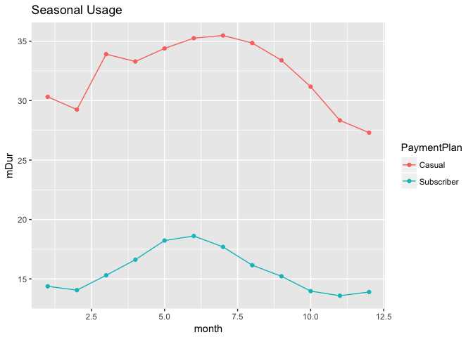
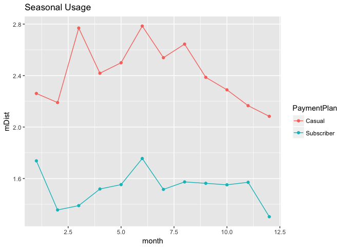
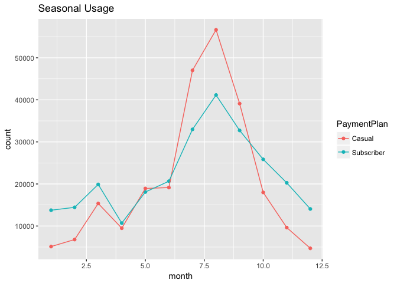
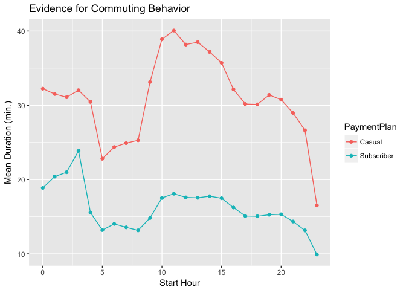
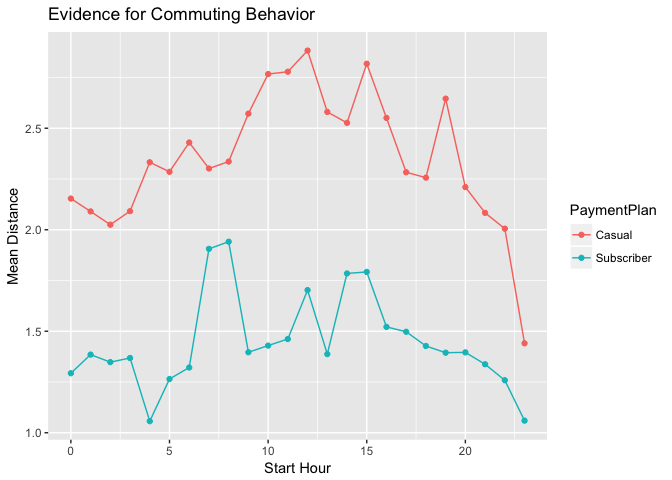
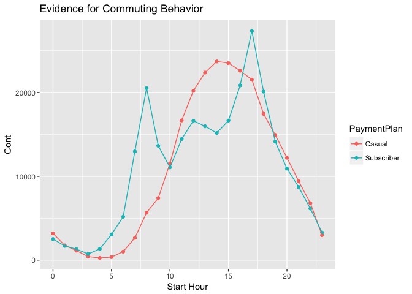

Tidy Tuesday Week 10
================
Sara Stoudt
6/6/2018

``` r
require(dplyr)
require(readr)
require(lubridate)
require(ggplot2)
```

#### Tidy the Raw Data.

Luckily, each file has the same header, so we can easily stack them.

``` r
setwd("~/Desktop/tidytuesday/data/PublicTripData")

toRead=list.files()

individ=lapply(toRead,read.csv)

full=do.call("rbind",individ)
head(full,1)
```

    ##   RouteID PaymentPlan         StartHub StartLatitude StartLongitude
    ## 1 1282087      Casual NE Sandy at 16th      45.52441      -122.6498
    ##   StartDate StartTime EndHub EndLatitude EndLongitude   EndDate EndTime
    ## 1 7/19/2016     10:22           45.53506    -122.6546 7/19/2016   10:48
    ##   TripType BikeID      BikeName Distance_Miles Duration RentalAccessPath
    ## 1            6083 0468 BIKETOWN           1.19  0:25:46           keypad
    ##   MultipleRental
    ## 1          FALSE

``` r
rm(individ)
```

#### Make Date and Time Information More Useful

``` r
full$StartDate=parse_date(full$StartDate,format="%m/%d/%Y")
full$StartTime=parse_time(full$StartTime)
full$EndTime=parse_time(full$EndTime)
full$durationHr=as.vector((full$EndTime-full$StartTime)/60) ## in minutes
full$StartHour=hour(full$StartTime)
```

#### Difference by Payment Plan

**Hypothesis**: Subscribers will travel further because they will be bike enthusiasts.

``` r
full %>% group_by(PaymentPlan)%>% summarise(mDur=mean(durationHr,na.rm=T),mDist=mean(Distance_Miles),missDu=sum(is.na(durationHr)),missD=sum(is.na(Distance_Miles)),maxDur=max(durationHr,na.rm=T)) 
```

    ## Warning in max(durationHr, na.rm = T): no non-missing arguments to max;
    ## returning -Inf

    ## # A tibble: 3 x 6
    ##   PaymentPlan   mDur mDist missDu missD maxDur
    ##   <fct>        <dbl> <dbl>  <int> <int>  <dbl>
    ## 1 Casual       20.2   2.54    138     0  1090.
    ## 2 Subscriber    9.58  1.55    168     0  1071.
    ## 3 ""          NaN    NA      4088  4088  -Inf

Negative duration? Weird! I just assumed the start and end date would be the same. They are, so we're just going to throw out the negative duration values.

``` r
tocheck=full[which(full$durationHr<0),]
table(tocheck$StartDate==tocheck$EndDate)
```

    ## Warning in table(tocheck$StartDate == tocheck$EndDate): Incompatible
    ## methods ("==.Date", "Ops.factor") for "=="

    ## 
    ## FALSE 
    ##  5034

``` r
fullR=full[-which(full$durationHr<0),]
```

I'm wrong! The casual users travel further on average than the subscribers.

``` r
fullR %>% group_by(PaymentPlan)%>% summarise(mDur=mean(durationHr,na.rm=T),mDist=mean(Distance_Miles),missDu=sum(is.na(durationHr)),missD=sum(is.na(Distance_Miles)),maxDur=max(durationHr,na.rm=T),sdDur=sd(durationHr,na.rm=T),sdDist=sd(Distance_Miles)) ## 
```

    ## Warning in max(durationHr, na.rm = T): no non-missing arguments to max;
    ## returning -Inf

    ## # A tibble: 3 x 8
    ##   PaymentPlan  mDur mDist missDu missD maxDur sdDur sdDist
    ##   <fct>       <dbl> <dbl>  <int> <int>  <dbl> <dbl>  <dbl>
    ## 1 Casual       33.7  2.51    138     0  1090.  35.6   21.7
    ## 2 Subscriber   15.8  1.54    168     0  1071.  25.2   25.0
    ## 3 ""          NaN   NA      4088  4088  -Inf   NA     NA

Subscribers do not seem to be more "hardcore" in terms of resilience to bad weather. Both groups have peak usage in the warmer months.

``` r
fullR=fullR[-which(fullR$PaymentPlan==""),]
fullR$month=month(fullR$StartDate)

toPlot=fullR %>% group_by(PaymentPlan,month)%>% summarise(mDur=mean(durationHr,na.rm=T),mDist=mean(Distance_Miles),count=n()) ## this seems surprising

ggplot(toPlot,aes(x=month,y=mDur,col=PaymentPlan,group=PaymentPlan))+geom_point()+geom_line()+ggtitle("Seasonal Usage")
```



``` r
ggplot(toPlot,aes(x=month,y=mDist,col=PaymentPlan,group=PaymentPlan))+geom_point()+geom_line()+ggtitle("Seasonal Usage")
```



``` r
ggplot(toPlot,aes(x=month,y=count,col=PaymentPlan,group=PaymentPlan))+geom_point()+geom_line()+ggtitle("Seasonal Usage")
```



Aha! It seems like subscribers are commuters. There are spikes in the morning and evening when people would be traveling to and from work. This makes sense now. Casual users may be biking around to explore while subscribers have a fixed and reasonable distance to work.

``` r
toPlot=fullR %>% group_by(PaymentPlan,StartHour)%>% summarise(mDur=mean(durationHr,na.rm=T),mDist=mean(Distance_Miles),count=n())

ggplot(toPlot,aes(x=StartHour,y=mDur,col=PaymentPlan,group=PaymentPlan))+geom_point()+geom_line()+xlab("Start Hour")+ylab("Mean Duration (min.)")+ggtitle("Evidence for Commuting Behavior")
```



``` r
ggplot(toPlot,aes(x=StartHour,y=mDist,col=PaymentPlan,group=PaymentPlan))+geom_point()+geom_line()+xlab("Start Hour")+ylab("Mean Distance")+ggtitle("Evidence for Commuting Behavior")
```



``` r
ggplot(toPlot,aes(x=StartHour,y=count,col=PaymentPlan,group=PaymentPlan))+geom_point()+geom_line()+xlab("Start Hour")+ylab("Cont")+ggtitle("Evidence for Commuting Behavior")
```



#### Ideas for Future Exploration

If we had user ids we could test my commuter hypothesis to see if the same user was travelling the same distance every morning and evening. (I understand that having user IDs would be a bit creepy given the latitude/longitude information.) I suppose I could try to use the latitude and longitude to figure out "home" and "work", but that seems tricky. Maybe for another time.

It seems like the durations and distances are a bit higher in the morning. Some hypotheses:

-   Duration: If there are hills it may be easier to go one way over the other.
-   Duration: There could me more traffic in the morning.
-   Duration and Distance: Users could stop somewhere on their way home (dinner, bar, gym, etc.) and then have two shorter rides.

Again, we would need user ids or to do something clever with the lat/lons if they were precise enough.
