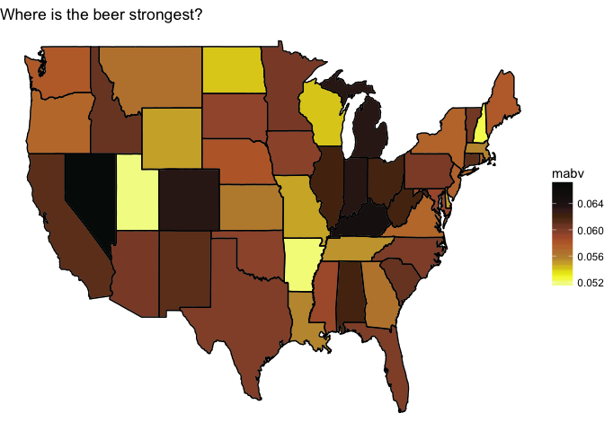
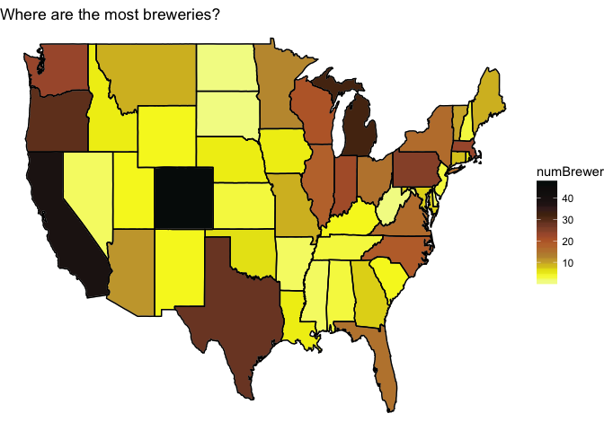
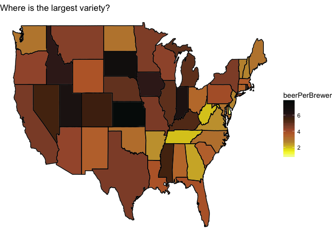
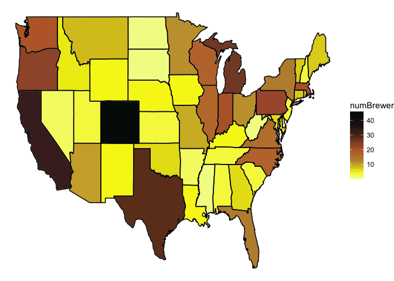
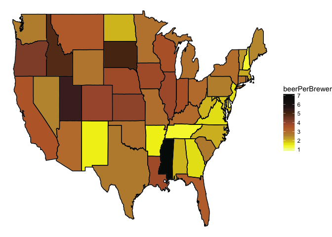
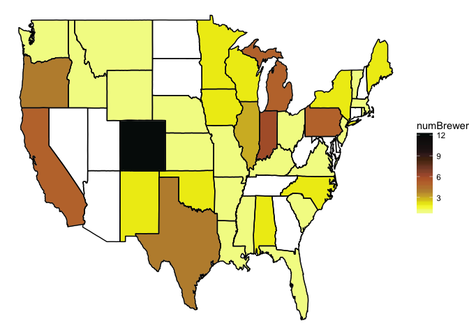
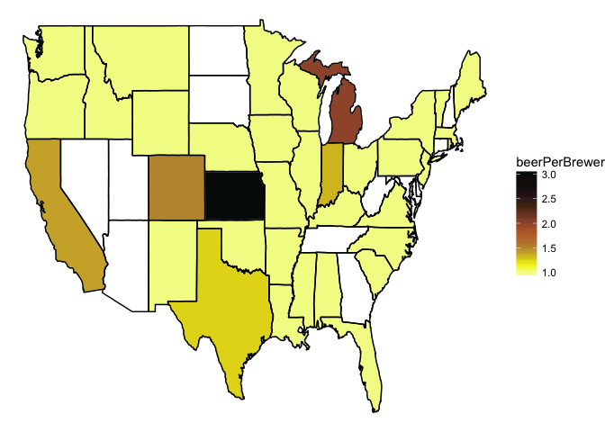
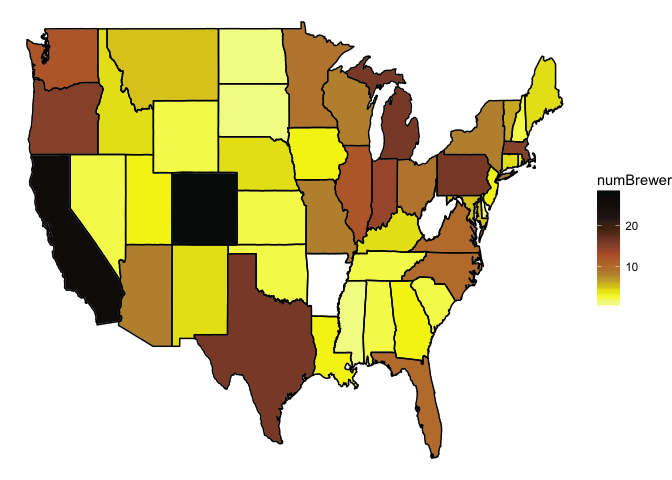

Tidy Tuesday Week 15
================
Sara Stoudt
7/16/2018

Week 15
=======

[Craft Beer USA](https://github.com/rfordatascience/tidytuesday/tree/master/data)

[data.world](https://data.world/)

[thrillist.com](https://www.thrillist.com/news/nation/most-craft-breweries-by-state-united-states)

``` r
require(readxl)
require(dplyr)
require(ggplot2)
require(stringr)
```

``` r
setwd("~/Desktop/tidytuesday/data")
beers=read_excel("week15_beers.xlsx",sheet=1)
brewer=read_excel("week15_beers.xlsx",sheet=2)
beer=inner_join(beers,brewer,by =c("brewery_id"="id"))
```

``` r
byState=beer %>% group_by(state) %>% summarise(numBrewer=length(unique(brewery_id)),count=n(),mabv=mean(abv,na.rm=T))
counties= map_data("county")
state=map_data("state")

stateInfo=cbind.data.frame(abb=state.abb,name=tolower(state.name))

state=inner_join(state,stateInfo,by=c("region"="name"))
```

    ## Warning: Column `region`/`name` joining character vector and factor,
    ## coercing into character vector

``` r
all_state=inner_join(state,byState,by=c("abb"="state"))
```

    ## Warning: Column `abb`/`state` joining factor and character vector, coercing
    ## into character vector

This palette isn't very visually appealing, but in the spirit of beer, I'll use it anyway.

``` r
#https://www.reddit.com/r/beer/comments/4gd24e/the_hex_colour_palette_of_beer/
beerPal=c("#F3F993","#F5F75C","#F6F513","#EAE615","#E0D01B","#D5BC26","#CDAA37","#C1963C","#BE8C3A","#BE823A","#C17A37","#BF7138","#BC6733","#B26033","#A85839","#985336","#8D4C32","#7C452D","#6B3A1E","#5D341A","#4E2A0C","#4A2727","#361F1B","#261716","#231716","#19100F","#16100F","#120D0C","#100B0A","#050B0A")  
```

Where to Bar Crawl?
-------------------

``` r
ggplot(data=state,mapping=aes(x=long,y=lat,group=group))+geom_polygon(data=all_state, aes(fill=mabv),color="grey")+labs(fill="mabv")+scale_fill_gradientn(colors=beerPal)+theme_void()+geom_path(data=state, aes(x=long,y=lat,group=group),color="black")+ggtitle("Where is the beer strongest?")
```



A stark (and believable) difference between Nevada and Utah.

``` r
ggplot(data=state,mapping=aes(x=long,y=lat,group=group))+
geom_polygon(data=all_state, aes(fill=numBrewer),color="grey")+labs(fill="numBrewer")+scale_fill_gradientn(colors=beerPal)+theme_void()+geom_path(data=state, aes(x=long,y=lat,group=group),color="black") +ggtitle("Where are the most breweries?")
```



Colorado maintains it's reputation.

``` r
ggplot(data=state,mapping=aes(x=long,y=lat,group=group))+geom_polygon(data=all_state, aes(fill=count/numBrewer),color="grey")+labs(fill="beerPerBrewer")+scale_fill_gradientn(colors=beerPal)+theme_void()+
geom_path(data=state, aes(x=long,y=lat,group=group),color="black")+ggtitle("Where is the largest variety?")
```



Surprisingly Kansas is where it is at!

``` r
beer %>% group_by(city,state) %>% summarise(count=n(),numBrewer=length(unique(brewery_id))) %>% arrange(desc(count))
```

    ## # A tibble: 401 x 4
    ## # Groups:   city [384]
    ##    city         state count numBrewer
    ##    <chr>        <chr> <int>     <int>
    ##  1 Grand Rapids MI       66         3
    ##  2 Chicago      IL       55         9
    ##  3 Portland     OR       52        11
    ##  4 Indianapolis IN       43         4
    ##  5 San Diego    CA       42         8
    ##  6 Boulder      CO       41         9
    ##  7 Denver       CO       40         8
    ##  8 Brooklyn     NY       38         4
    ##  9 Seattle      WA       35         9
    ## 10 Longmont     CO       33         1
    ## # ... with 391 more rows

``` r
beer %>% group_by(city,state) %>% summarise(count=n(),numBrewer=length(unique(brewery_id))) %>% arrange(desc(numBrewer))
```

    ## # A tibble: 401 x 4
    ## # Groups:   city [384]
    ##    city          state count numBrewer
    ##    <chr>         <chr> <int>     <int>
    ##  1 Portland      OR       52        11
    ##  2 Boulder       CO       41         9
    ##  3 Chicago       IL       55         9
    ##  4 Seattle       WA       35         9
    ##  5 Austin        TX       25         8
    ##  6 Denver        CO       40         8
    ##  7 San Diego     CA       42         8
    ##  8 Bend          OR       11         6
    ##  9 Portland      ME       12         6
    ## 10 San Francisco CA       32         5
    ## # ... with 391 more rows

Somebody please tell me about the hidden gem of Grand Rapids. Apparently, it is [Beer City, USA](https://www.experiencegr.com/things-to-do/beer-city/).

Styles
------

There are too many styles, so I pick some major ones and investigate them.

``` r
stout=beer[str_detect(beer$style,"Stout"),] 
american=beer[str_detect(beer$style,"American"),]
ipa=beer[str_detect(beer$style,"IPA"),]
```

**True American?**

``` r
byStateA=american %>% group_by(state) %>% summarise(numBrewer=length(unique(brewery_id)),count=n(),mabv=mean(abv,na.rm=T))

all_state=inner_join(state,byStateA,by=c("abb"="state"))
```

    ## Warning: Column `abb`/`state` joining factor and character vector, coercing
    ## into character vector

``` r
ggplot(data=state,mapping=aes(x=long,y=lat,group=group))+geom_polygon(data=all_state, aes(fill=numBrewer),color="grey")+labs(fill="numBrewer")+scale_fill_gradientn(colors=beerPal)+theme_void()+geom_path(data=state, aes(x=long,y=lat,group=group),color="black")
```



``` r
ggplot(data=state,mapping=aes(x=long,y=lat,group=group))+geom_polygon(data=all_state, aes(fill=count/numBrewer),color="grey")+labs(fill="beerPerBrewer")+scale_fill_gradientn(colors=beerPal)+theme_void()+geom_path(data=state, aes(x=long,y=lat,group=group),color="black") 
```



Mississippi: American Beer's Hearland

**Representing my namesake**

``` r
byStateS=stout %>% group_by(state) %>% summarise(numBrewer=length(unique(brewery_id)),count=n(),mabv=mean(abv,na.rm=T))
  
all_state=inner_join(state,byStateS,by=c("abb"="state"))
```

    ## Warning: Column `abb`/`state` joining factor and character vector, coercing
    ## into character vector

``` r
ggplot(data=state,mapping=aes(x=long,y=lat,group=group))+geom_polygon(data=all_state, aes(fill=numBrewer),color="grey")+labs(fill="numBrewer")+scale_fill_gradientn(colors=beerPal)+theme_void()+geom_path(data=state, aes(x=long,y=lat,group=group),color="black") 
```



``` r
ggplot(data=state,mapping=aes(x=long,y=lat,group=group))+geom_polygon(data=all_state, aes(fill=count/numBrewer),color="grey")+labs(fill="beerPerBrewer")+scale_fill_gradientn(colors=beerPal)+theme_void()+geom_path(data=state, aes(x=long,y=lat,group=group),color="black") 
```



What's up with some states having no stouts?!

**The controversial IPA**

``` r
byStateI=ipa %>% group_by(state) %>% summarise(numBrewer=length(unique(brewery_id)),count=n(),mabv=mean(abv,na.rm=T))
  
all_state=inner_join(state,byStateI,by=c("abb"="state"))
```

    ## Warning: Column `abb`/`state` joining factor and character vector, coercing
    ## into character vector

``` r
ggplot(data=state,mapping=aes(x=long,y=lat,group=group))+geom_polygon(data=all_state, aes(fill=numBrewer),color="grey")+labs(fill="numBrewer")+scale_fill_gradientn(colors=beerPal)+theme_void()+geom_path(data=state, aes(x=long,y=lat,group=group),color="black") 
```



``` r
ggplot(data=state,mapping=aes(x=long,y=lat,group=group))+
geom_polygon(data=all_state, aes(fill=count/numBrewer),color="grey")+labs(fill="beerPerBrewer")+scale_fill_gradientn(colors=beerPal)+theme_void()+
geom_path(data=state, aes(x=long,y=lat,group=group),color="black") 
```


``` r
## what's up with Utah?
ut=beer[which(beer$state == "UT"),]
ut[str_detect(ut$style, "IPA"),] ## double counting
```

    ## # A tibble: 8 x 12
    ##   count.x    abv   ibu    id name.x style brewery_id ounces count.y name.y
    ##     <dbl>  <dbl> <dbl> <dbl> <chr>  <chr>      <dbl>  <dbl>   <dbl> <chr> 
    ## 1   1382. 0.0400   NA   644. Johnn… Amer…       399.    16.    400. Moab …
    ## 2   2254. 0.0400   42. 1925. Trade… Amer…       159.    12.    160. Uinta…
    ## 3   2255. 0.0730   83. 1723. Hop N… Amer…       159.    12.    160. Uinta…
    ## 4   2258. 0.0730   82. 1089. Hop N… Amer…       159.    12.    160. Uinta…
    ## 5   2300. 0.0900   75. 1825. Squat… Amer…       302.    12.    303. Utah …
    ## 6   2302. 0.0600   NA  1823. Wasat… Amer…       302.    12.    303. Utah …
    ## 7   2303. 0.0600   NA  1682. Wasat… Amer…       302.    12.    303. Utah …
    ## 8   2305. 0.0900   75. 1680. Squat… Amer…       302.    12.    303. Utah …
    ## # ... with 2 more variables: city <chr>, state <chr>

West Virginia and Arkansas are not into IPAs.

### Variation in ABV

Which styles have the most variation in alcohol content (of the top 20 most prevalent styles) given their average value?

``` r
beer %>% group_by(style)%>% summarise(count=n(),coeffVarabv=mean(abv,na.rm=T)/sd(abv,na.rm=T)) %>% arrange(desc(count))  %>% head(20) %>% arrange(desc(coeffVarabv))
```

    ## # A tibble: 20 x 3
    ##    style                          count coeffVarabv
    ##    <chr>                          <int>       <dbl>
    ##  1 American Double / Imperial IPA   105       12.5 
    ##  2 Kölsch                           42       11.4 
    ##  3 American Amber / Red Lager        29       10.7 
    ##  4 American Blonde Ale              108       10.0 
    ##  5 Märzen / Oktoberfest             30        9.72
    ##  6 Hefeweizen                        40        9.44
    ##  7 American Pale Ale (APA)          245        8.63
    ##  8 Cider                             37        7.58
    ##  9 American Pale Wheat Ale           97        7.55
    ## 10 American IPA                     424        7.33
    ## 11 American Stout                    39        7.17
    ## 12 German Pilsener                   36        7.01
    ## 13 American Porter                   68        6.96
    ## 14 American Amber / Red Ale         133        6.62
    ## 15 American Pale Lager               39        6.27
    ## 16 American Brown Ale                70        5.97
    ## 17 American Black Ale                36        5.49
    ## 18 Fruit / Vegetable Beer            49        5.44
    ## 19 Saison / Farmhouse Ale            52        5.41
    ## 20 Witbier                           51        4.79

Fancy string matching for another time: match the beer style to the colors listed [here](https://www.twobeerdudes.com/beer/srm).
