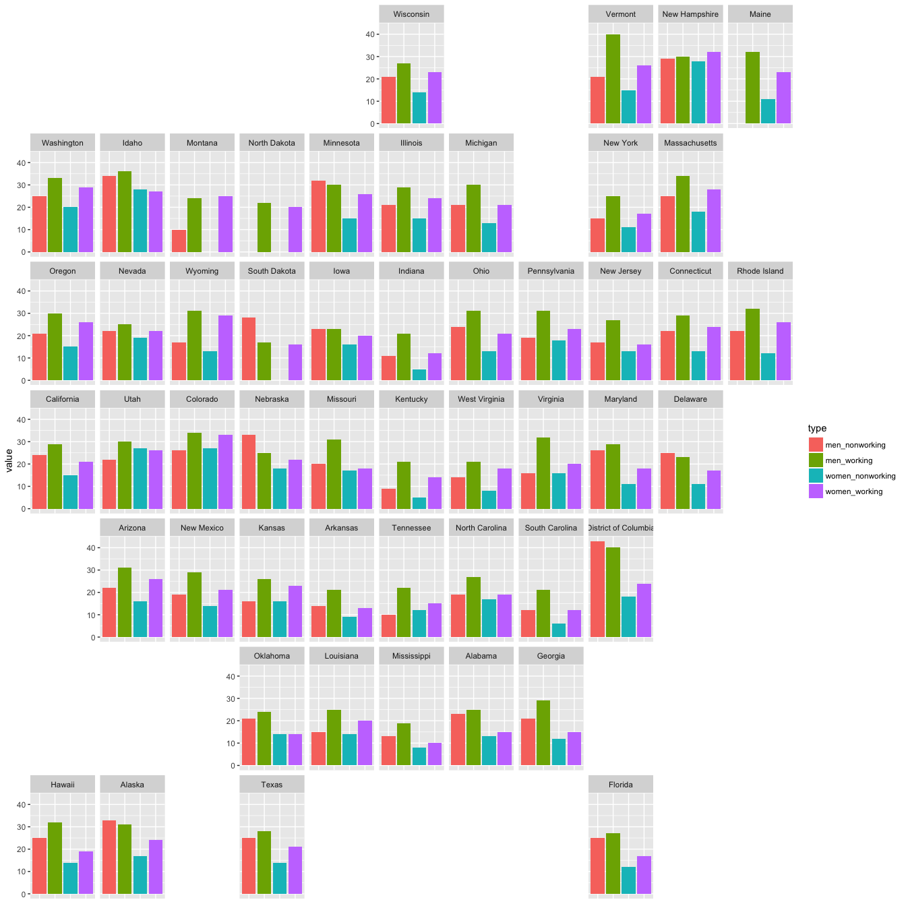
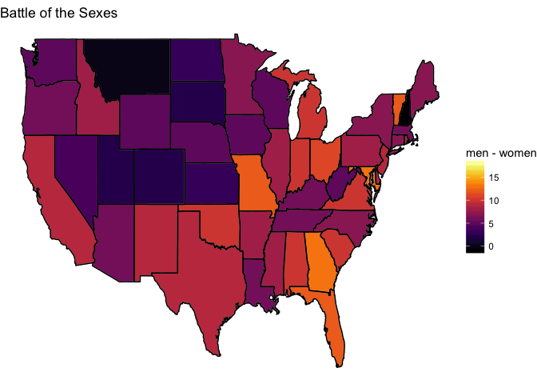
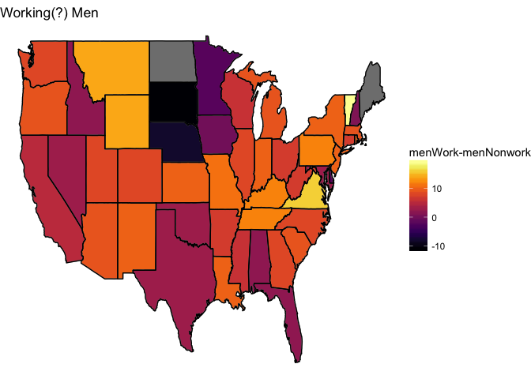

Tidy Tuesday Week 16
================
Sara Stoudt
7/17/2018

Week 16
=======

[CDC](https://www.cdc.gov/)

[CDC - National Health Statistics Reports](https://www.cdc.gov/nchs/data/nhsr/nhsr112.pdf)|

``` r
require(readxl)
require(dplyr)
require(ggplot2)
require(stringr)
require(tidyr)
require(geofacet)
require(viridis)
```

``` r
setwd("~/Desktop/tidytuesday/data")
exercise=read_excel("week16_exercise.xlsx",sheet=1)

exercise=exercise[,-1] ## remove count
exercise=exercise[-1,] ## remove "all states""

exerciseT=exercise %>% gather(type, value,-state)
exerciseT$value=as.numeric(exerciseT$value)
```

    ## Warning: NAs introduced by coercion

You Better Work
---------------

I expected that working men and women would have less time to exercise, but it looks like those who work meet the federal guidelines for exercise more across the US.

Some potential reasons:

-   physical and financial access to gyms for workers
-   caretaking responsibilities for those "non-workers" prevent exercise
-   jobs that involve physical labor count as exercise? nope, CDC says "leisure-time physical activity"
-   seeing coworkers on a daily basis motivates you to exercise

``` r
ggplot(subset(exerciseT,type %in% c("men_nonworking","men_working","women_nonworking","women_working")),aes(x=type,y=value,fill=type))+ geom_bar(stat="identity",position = position_dodge2(preserve = "total"))+facet_geo(~state)+ theme(axis.title.x=element_blank(),
        axis.text.x=element_blank(),
        axis.ticks.x=element_blank())
```



Where are the largest/smallest disparities?
-------------------------------------------

In honor of the theme of sweating, I mean exercise, I'm switching to the inferno palette.

``` r
exercise[2:ncol(exercise)]=apply(exercise[2:ncol(exercise)],2,function(x){as.numeric(x)})

counties= map_data("county")
state=map_data("state")

exercise$state=tolower(exercise$state)

all_state=inner_join(state,exercise,by=c("region"="state"))
```

What's striking here is that there is only one negative value. Only in New Hampshire do women meet the guidelines more than men. In DC, the difference between genders is largest, while Montana has the smallest difference.

``` r
ggplot(data=state,mapping=aes(x=long,y=lat,group=group))+geom_polygon(data=all_state, aes(fill=men-women),color="grey")+labs(fill="men - women")+scale_fill_viridis(option="inferno")+theme_void()+geom_path(data=state, aes(x=long,y=lat,group=group),color="black")+ggtitle("Battle of the Sexes")
```



``` r
exercise$state[which(exercise$men-exercise$women<0)]
```

    ## [1] "new hampshire"

``` r
exercise$state[which.max(abs(exercise$men-exercise$women))] 
```

    ## [1] "district of columbia"

``` r
exercise$state[which.min(abs(exercise$men-exercise$women))] 
```

    ## [1] "montana"

In South Dakota and Nebraska nonworking men meet the guidelines more than working men. Vermont has the biggest disparity while Iowa has the smallest.

``` r
ggplot(data=state,mapping=aes(x=long,y=lat,group=group))+geom_polygon(data=all_state, aes(fill=men_working-men_nonworking),color="grey")+labs(fill="menWork-menNonwork")+scale_fill_viridis(option="inferno")+theme_void()+geom_path(data=state, aes(x=long,y=lat,group=group),color="black")+ggtitle("Working(?) Men")
```



``` r
exercise$state[which.max(abs(exercise$men_working-exercise$men_nonworking))] 
```

    ## [1] "vermont"

``` r
exercise$state[which.min(abs(exercise$men_working-exercise$men_nonworking))] 
```

    ## [1] "iowa"

In Idaho and Utah nonworking women meet the guidelines more than working women. Wyoming has the biggest disparity while Oklahoma has the smallest.

``` r
ggplot(data=state,mapping=aes(x=long,y=lat,group=group))+geom_polygon(data=all_state, aes(fill=women_working-women_nonworking),color="grey")+labs(fill="womenWork-womenNonwork")+scale_fill_viridis(option="inferno")+theme_void()+geom_path(data=state, aes(x=long,y=lat,group=group),color="black")+ggtitle("Working(?) Women")
```


``` r
exercise$state[which(exercise$women_working-exercise$women_nonworking<0)]
```

    ## [1] "idaho" "utah"

``` r
exercise$state[which.max(abs(exercise$women_working-exercise$women_nonworking))] 
```

    ## [1] "wyoming"

``` r
exercise$state[which.min(abs(exercise$women_working-exercise$women_nonworking))] 
```

    ## [1] "oklahoma"
