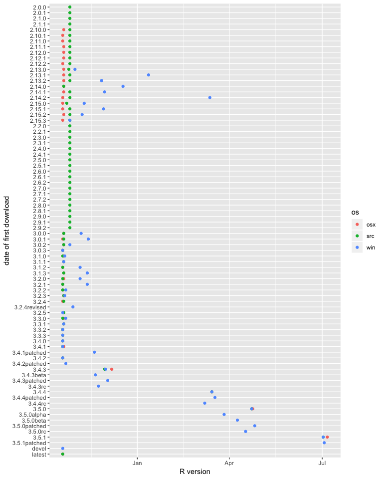
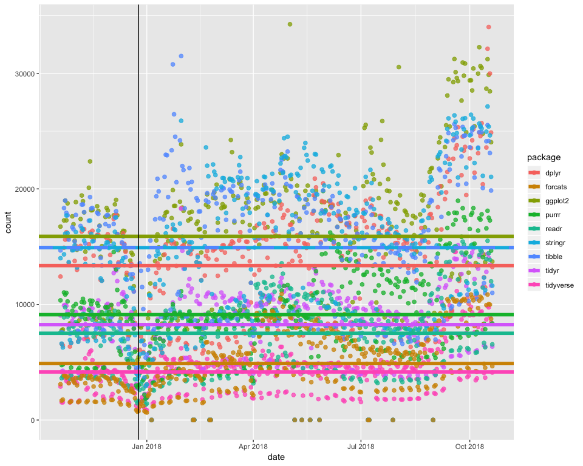

Tidy Tuesday Week 31
================
Sara Stoudt
10/30/2018

<style>
  .superbigimage{
      overflow-x:scroll;
      white-space: nowrap;
  }

  .superbigimage img{
     max-width: none;
  }

/* https://stackoverflow.com/questions/52448104/how-to-add-horizontal-scroll-bar-for-a-ggplot-plot-in-rmarkdown-html*/
</style>
``` r
library(ggplot2)
library(dplyr)
library(tidyr)
library(forcats)
library(cranlogs)

setwd("~/Desktop/tidytuesday/data/2018-10-30")
rd=read.csv("r_downloads_year.csv")
rd$date=as.Date(as.character(rd$date))
```

### First download of each R version

``` r
rd %>% drop_na(os) %>% group_by(version,os) %>% summarise(first=min(date)) %>% ggplot(.,aes(fct_rev(version),as.Date(first),col=os))+ geom_point()+coord_flip()+xlab("date of first download")+ylab("R version")
```



**Take-Aways**

-   Windows often lags.
-   I suspect "devel" and "latest" are relative to the current version since they appear early on.

### Tidyverse and its components

``` r
tidyverse=cran_downloads(package="tidyverse",from=min(rd$date),to=max(rd$date))
ggpl=cran_downloads(package="ggplot2",from=min(rd$date),to=max(rd$date))
dp=cran_downloads(package="dplyr",from=min(rd$date),to=max(rd$date))
tid=cran_downloads(package="tidyr",from=min(rd$date),to=max(rd$date))
re=cran_downloads(package="readr",from=min(rd$date),to=max(rd$date))
pr=cran_downloads(package="purrr",from=min(rd$date),to=max(rd$date))
tib=cran_downloads(package="tibble",from=min(rd$date),to=max(rd$date))
st=cran_downloads(package="stringr",from=min(rd$date),to=max(rd$date))
fc=cran_downloads(package="forcats",from=min(rd$date),to=max(rd$date))


allTy=rbind.data.frame(tidyverse,ggpl,dp,tid,re,pr,tib,st,fc)

## add a horizontal line representing mean, help us pick out different colors
orderV=allTy %>% group_by(package) %>% summarise(mV=mean(count)) %>% arrange(mV)
```

``` r
ggplot(allTy,aes(date,count,col=package))+geom_point(size=2,alpha=.75)+geom_hline(data=orderV,aes(yintercept=mV,col=package),lwd=2,lty=c(rep(1,7),2,1))+geom_vline(aes(xintercept=as.Date("2017-12-25")))
```



Note: `stringr` and `tibble` are on top of one another.

**Take-Aways**

-   The average number of downloads of `tidyverse` is less than the average number of downloads for each of its components. This makes sense because we can either download all packages at once via `tidyverse` or download the components separately.

-   `ggplot2` has the highest average number of downloads.

-   `stringr` and `tibble` have similar average number of downloads.

-   There is some evidence of a bit of work life balance as there is a noticeable drop off in downloads on Christmas.
