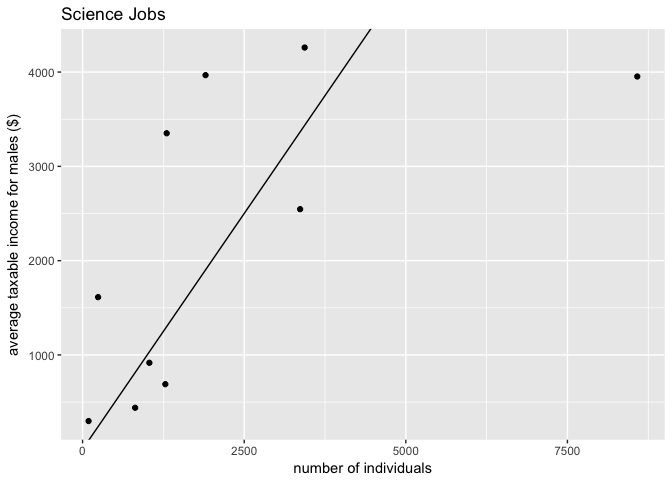
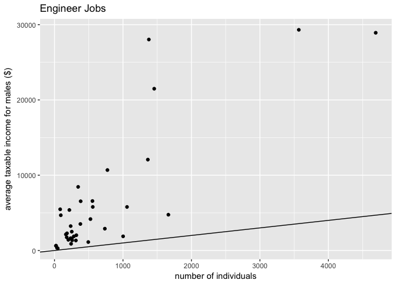
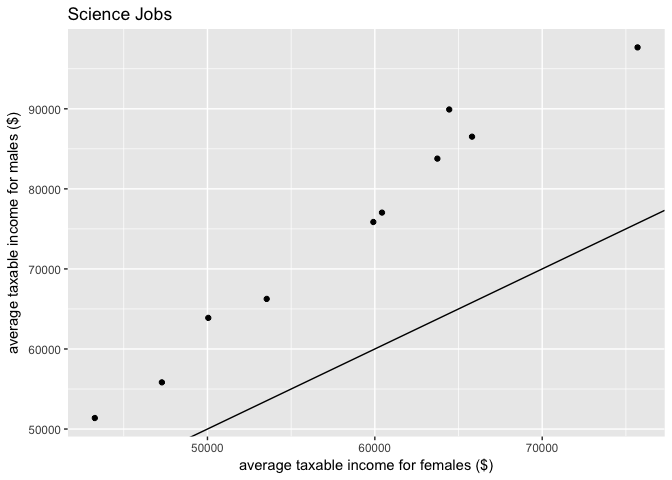
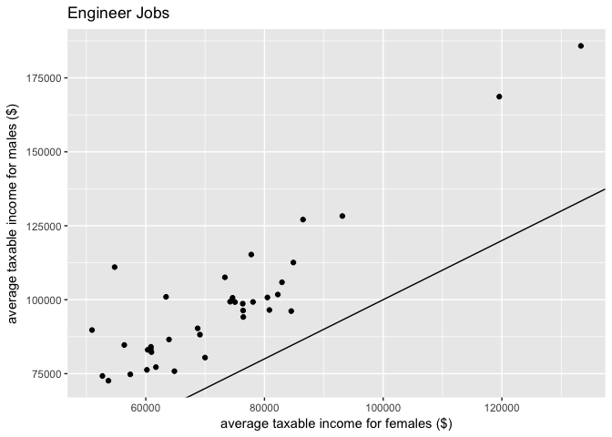

Tidy Tuesday Week 4
================
Sara Stoudt
4/24/2018

Week 4 - Gender differences in Australian Average Taxable Income
================================================================

[RAW DATA](https://github.com/rfordatascience/tidytuesday/blob/master/data/week4_australian_salary.csv)
[Article](http://www.womensagenda.com.au/latest/eds-blog/australia-s-50-highest-paying-jobs-are-paying-men-significantly-more/)
[DataSource: data.gov.au](https://data.gov.au/dataset/taxation-statistics-2013-14/resource/c506c052-be2f-4fba-8a65-90f9e60f7775?inner_span=True)

#### Disparities in STEM

**Take-aways**

1.  About equal number of indivuals in scientist jobs.
2.  Many more males in engineering jobs.

(to be fair, should look into proportion of work force)

1.  Rough OLS interpretation: For every dollar a woman makes in science, a man makes $1.52.
2.  Rough OLS interpretation: For every dollar a woman makes in engineering, a man makes $1.26.

``` r
setwd("~/Desktop/tidytuesday/data")
aus<-read.csv("week4_australian_salary.csv")

require(ggplot2)
require(plotly) ## use to hover and see the job names
```

### Look for STEM jobs.

``` r
aus[grep("stat",aus$occupation),] ## looking for statistics
```

    ##         X gender_rank                                  occupation gender
    ## 1131 1131         907 Garage attendant; Service station attendant Female
    ## 1132 1132         979 Garage attendant; Service station attendant   Male
    ## 1786 1786         170                     Railway station manager Female
    ## 1787 1787         174                     Railway station manager   Male
    ## 1792 1792         250                  Real estate agency manager Female
    ## 1793 1793         111                  Real estate agency manager   Male
    ## 1794 1794         305                           Real estate agent Female
    ## 1795 1795         239                           Real estate agent   Male
    ## 1796 1796         538                Real estate property manager Female
    ## 1797 1797         210                Real estate property manager   Male
    ## 1994 1994         385                     Stock and station agent Female
    ## 1995 1995         457                     Stock and station agent   Male
    ##      individuals average_taxable_income
    ## 1131        2434                  31906
    ## 1132        2678                  34126
    ## 1786         196                  74737
    ## 1787        1220                  97952
    ## 1792        2326                  66271
    ## 1793        2437                 110559
    ## 1794        6997                  62056
    ## 1795       10983                  88045
    ## 1796       18088                  49080
    ## 1797        6708                  92500
    ## 1994         108                  57899
    ## 1995        1204                  67675

``` r
aus[grep("math",aus$occupation),] ## nope
```

    ## [1] X                      gender_rank            occupation            
    ## [4] gender                 individuals            average_taxable_income
    ## <0 rows> (or 0-length row.names)

``` r
scientist=aus[grep("scien",aus$occupation),] ## bingo
engineer=aus[grep("engineer",aus$occupation),]
```

Get things organized. Not particularly tidy, but bear with me.

``` r
scientistG=split(scientist,scientist$gender)
engineerG=split(engineer,engineer$gender)

names(scientistG[[1]])=paste("F",names(scientistG[[1]]),sep="")
names(scientistG[[2]])=paste("M",names(scientistG[[2]]),sep="")

names(engineerG[[1]])=paste("F",names(engineerG[[1]]),sep="")
names(engineerG[[2]])=paste("M",names(engineerG[[2]]),sep="")

scientistFull=cbind(scientistG[[1]],scientistG[[2]])
engineerFull=cbind(engineerG[[1]],engineerG[[2]])
```

### Look at number of individuals in each job

The line is y=x. If there was gender parity, we would see points lying around this line. You can hover to see the job titles.

``` r
p <- ggplot(scientistFull, aes(x = Findividuals, y = Mindividuals, text =Moccupation)) +
  geom_point() +geom_abline(intercept = 0, slope = 1)+xlab("number of individuals")+
  ylab("average taxable income for males ($)")+ggtitle("Science Jobs")
p ## for static version on github
```



``` r
p <- ggplotly(p)
p
```

    ## PhantomJS not found. You can install it with webshot::install_phantomjs(). If it is installed, please make sure the phantomjs executable can be found via the PATH variable.

<!--html_preserve-->

<script type="application/json" data-for="4bba2630e15c">{"x":{"data":[{"x":[1301,3365,1033,1902,3435,813,1280,8580,93,240],"y":[3351,2546,917,3967,4260,440,690,3953,299,1613],"text":["~Findividuals: 1301<br />~Mindividuals: 3351<br />Agricultural scientist; Agronomist","~Findividuals: 3365<br />~Mindividuals: 2546<br />Biologist; Life scientist","~Findividuals: 1033<br />~Mindividuals:  917<br />Ceramics scientist; Exercise physiologist; Polymer scientist; Sports scientist","~Findividuals: 1902<br />~Mindividuals: 3967<br />Earth science technician; Soil technician","~Findividuals: 3435<br />~Mindividuals: 4260<br />Environmental scientist","~Findividuals:  813<br />~Mindividuals:  440<br />Geographer; Social scientist","~Findividuals: 1280<br />~Mindividuals:  690<br />Life science technician","~Findividuals: 8580<br />~Mindividuals: 3953<br />Medical laboratory scientist","~Findividuals:   93<br />~Mindividuals:  299<br />Soil scientist","~Findividuals:  240<br />~Mindividuals: 1613<br />Spatial science technician; Surveying or spatial science technician; Surveying technician"],"type":"scatter","mode":"markers","marker":{"autocolorscale":false,"color":"rgba(0,0,0,1)","opacity":1,"size":5.66929133858268,"symbol":"circle","line":{"width":1.88976377952756,"color":"rgba(0,0,0,1)"}},"hoveron":"points","showlegend":false,"xaxis":"x","yaxis":"y","hoverinfo":"text","frame":null},{"x":[-331.35,9004.35],"y":[-331.35,9004.35],"text":"~intercept: 0<br />~slope: 1","type":"scatter","mode":"lines","line":{"width":1.88976377952756,"color":"rgba(0,0,0,1)","dash":"solid"},"hoveron":"points","showlegend":false,"xaxis":"x","yaxis":"y","hoverinfo":"text","frame":null}],"layout":{"margin":{"t":43.7625570776256,"r":7.30593607305936,"b":40.1826484018265,"l":48.9497716894977},"plot_bgcolor":"rgba(235,235,235,1)","paper_bgcolor":"rgba(255,255,255,1)","font":{"color":"rgba(0,0,0,1)","family":"","size":14.6118721461187},"title":"Science Jobs","titlefont":{"color":"rgba(0,0,0,1)","family":"","size":17.5342465753425},"xaxis":{"domain":[0,1],"type":"linear","autorange":false,"range":[-331.35,9004.35],"tickmode":"array","ticktext":["0","2500","5000","7500"],"tickvals":[0,2500,5000,7500],"categoryorder":"array","categoryarray":["0","2500","5000","7500"],"nticks":null,"ticks":"outside","tickcolor":"rgba(51,51,51,1)","ticklen":3.65296803652968,"tickwidth":0.66417600664176,"showticklabels":true,"tickfont":{"color":"rgba(77,77,77,1)","family":"","size":11.689497716895},"tickangle":-0,"showline":false,"linecolor":null,"linewidth":0,"showgrid":true,"gridcolor":null,"gridwidth":0,"zeroline":false,"anchor":"y","title":"number of individuals","titlefont":{"color":"rgba(0,0,0,1)","family":"","size":14.6118721461187},"hoverformat":".2f"},"yaxis":{"domain":[0,1],"type":"linear","autorange":false,"range":[100.95,4458.05],"tickmode":"array","ticktext":["1000","2000","3000","4000"],"tickvals":[1000,2000,3000,4000],"categoryorder":"array","categoryarray":["1000","2000","3000","4000"],"nticks":null,"ticks":"outside","tickcolor":"rgba(51,51,51,1)","ticklen":3.65296803652968,"tickwidth":0.66417600664176,"showticklabels":true,"tickfont":{"color":"rgba(77,77,77,1)","family":"","size":11.689497716895},"tickangle":-0,"showline":false,"linecolor":null,"linewidth":0,"showgrid":true,"gridcolor":null,"gridwidth":0,"zeroline":false,"anchor":"x","title":"average taxable income for males ($)","titlefont":{"color":"rgba(0,0,0,1)","family":"","size":14.6118721461187},"hoverformat":".2f"},"shapes":[{"type":"rect","fillcolor":null,"line":{"color":null,"width":0,"linetype":[]},"yref":"paper","xref":"paper","x0":0,"x1":1,"y0":0,"y1":1}],"showlegend":false,"legend":{"bgcolor":"rgba(255,255,255,1)","bordercolor":"transparent","borderwidth":1.88976377952756,"font":{"color":"rgba(0,0,0,1)","family":"","size":11.689497716895}},"hovermode":"closest","barmode":"relative"},"config":{"doubleClick":"reset","modeBarButtonsToAdd":[{"name":"Collaborate","icon":{"width":1000,"ascent":500,"descent":-50,"path":"M487 375c7-10 9-23 5-36l-79-259c-3-12-11-23-22-31-11-8-22-12-35-12l-263 0c-15 0-29 5-43 15-13 10-23 23-28 37-5 13-5 25-1 37 0 0 0 3 1 7 1 5 1 8 1 11 0 2 0 4-1 6 0 3-1 5-1 6 1 2 2 4 3 6 1 2 2 4 4 6 2 3 4 5 5 7 5 7 9 16 13 26 4 10 7 19 9 26 0 2 0 5 0 9-1 4-1 6 0 8 0 2 2 5 4 8 3 3 5 5 5 7 4 6 8 15 12 26 4 11 7 19 7 26 1 1 0 4 0 9-1 4-1 7 0 8 1 2 3 5 6 8 4 4 6 6 6 7 4 5 8 13 13 24 4 11 7 20 7 28 1 1 0 4 0 7-1 3-1 6-1 7 0 2 1 4 3 6 1 1 3 4 5 6 2 3 3 5 5 6 1 2 3 5 4 9 2 3 3 7 5 10 1 3 2 6 4 10 2 4 4 7 6 9 2 3 4 5 7 7 3 2 7 3 11 3 3 0 8 0 13-1l0-1c7 2 12 2 14 2l218 0c14 0 25-5 32-16 8-10 10-23 6-37l-79-259c-7-22-13-37-20-43-7-7-19-10-37-10l-248 0c-5 0-9-2-11-5-2-3-2-7 0-12 4-13 18-20 41-20l264 0c5 0 10 2 16 5 5 3 8 6 10 11l85 282c2 5 2 10 2 17 7-3 13-7 17-13z m-304 0c-1-3-1-5 0-7 1-1 3-2 6-2l174 0c2 0 4 1 7 2 2 2 4 4 5 7l6 18c0 3 0 5-1 7-1 1-3 2-6 2l-173 0c-3 0-5-1-8-2-2-2-4-4-4-7z m-24-73c-1-3-1-5 0-7 2-2 3-2 6-2l174 0c2 0 5 0 7 2 3 2 4 4 5 7l6 18c1 2 0 5-1 6-1 2-3 3-5 3l-174 0c-3 0-5-1-7-3-3-1-4-4-5-6z"},"click":"function(gd) { \n        // is this being viewed in RStudio?\n        if (location.search == '?viewer_pane=1') {\n          alert('To learn about plotly for collaboration, visit:\\n https://cpsievert.github.io/plotly_book/plot-ly-for-collaboration.html');\n        } else {\n          window.open('https://cpsievert.github.io/plotly_book/plot-ly-for-collaboration.html', '_blank');\n        }\n      }"}],"cloud":false},"source":"A","attrs":{"4bba2ec219ba":{"x":{},"y":{},"text":{},"type":"scatter"},"4bba49271a51":{"intercept":{},"slope":{}}},"cur_data":"4bba2ec219ba","visdat":{"4bba2ec219ba":["function (y) ","x"],"4bba49271a51":["function (y) ","x"]},"highlight":{"on":"plotly_click","persistent":false,"dynamic":false,"selectize":false,"opacityDim":0.2,"selected":{"opacity":1}},"base_url":"https://plot.ly"},"evals":["config.modeBarButtonsToAdd.0.click"],"jsHooks":{"render":[{"code":"function(el, x) { var ctConfig = crosstalk.var('plotlyCrosstalkOpts').set({\"on\":\"plotly_click\",\"persistent\":false,\"dynamic\":false,\"selectize\":false,\"opacityDim\":0.2,\"selected\":{\"opacity\":1}}); }","data":null}]}}</script>
<!--/html_preserve-->
``` r
p <- ggplot(engineerFull, aes(x = Findividuals, y = Mindividuals, text =Moccupation)) +
  geom_point() +geom_abline(intercept = 0, slope = 1)+xlab("number of individuals")+
  ylab("average taxable income for males ($)")+ggtitle("Engineer Jobs")
p ## for static version on github
```



``` r
p <- ggplotly(p)
p
```

<!--html_preserve-->

<script type="application/json" data-for="4bba64704563">{"x":{"data":[{"x":[182,36,236,258,242,1663,3568,1059,166,773,1456,312,345,47,217,382,1002,282,252,493,1363,735,92,24,202,1378,236,83,554,319,559,4691,525,378,20,179,252],"y":[2280,348,1634,1357,884,4751,29314,5785,2135,10687,21488,1330,8451,286,5378,6539,1881,1879,2502,1121,12071,2896,4683,630,1416,28026,3239,5475,6571,2027,5788,28921,4173,3520,632,1746,1564],"text":["~Findividuals:  182<br />~Mindividuals:  2280<br />Aeronautical engineer","~Findividuals:   36<br />~Mindividuals:   348<br />Agricultural engineer","~Findividuals:  236<br />~Mindividuals:  1634<br />Air safety inspector or investigator; Aircraft navigator; Airways surveyor; Airworthiness surveyor; Aviation safety inspector; Flight engineer","~Findividuals:  258<br />~Mindividuals:  1357<br />Aircraft draftsperson; Biomedical engineering technician or associate; Chemical engineering technician; Mining draftsperson; Shipbuilding draftsperson","~Findividuals:  242<br />~Mindividuals:   884<br />Biomedical engineer","~Findividuals: 1663<br />~Mindividuals:  4751<br />Chemical engineer","~Findividuals: 3568<br />~Mindividuals: 29314<br />Civil engineer","~Findividuals: 1059<br />~Mindividuals:  5785<br />Civil engineering draftsperson; Structural draftsperson","~Findividuals:  166<br />~Mindividuals:  2135<br />Civil engineering technician or associate","~Findividuals:  773<br />~Mindividuals: 10687<br />Computer network and systems engineer","~Findividuals: 1456<br />~Mindividuals: 21488<br />Electrical engineer","~Findividuals:  312<br />~Mindividuals:  1330<br />Electrical engineering draftsperson","~Findividuals:  345<br />~Mindividuals:  8451<br />Electrical engineering technician; Electrical tester; Electronics tester","~Findividuals:   47<br />~Mindividuals:   286<br />Electronic engineering draftsperson","~Findividuals:  217<br />~Mindividuals:  5378<br />Electronic engineering technician","~Findividuals:  382<br />~Mindividuals:  6539<br />Electronics engineer","~Findividuals: 1002<br />~Mindividuals:  1881<br />Environmental engineer","~Findividuals:  282<br />~Mindividuals:  1879<br />Geotechnical engineer","~Findividuals:  252<br />~Mindividuals:  2502<br />Industrial engineer","~Findividuals:  493<br />~Mindividuals:  1121<br />IT quality assurance engineer","~Findividuals: 1363<br />~Mindividuals: 12071<br />IT support engineer","~Findividuals:  735<br />~Mindividuals:  2896<br />IT systems test engineer","~Findividuals:   92<br />~Mindividuals:  4683<br />Marine engineer","~Findividuals:   24<br />~Mindividuals:   630<br />Marine engineer surveyor","~Findividuals:  202<br />~Mindividuals:  1416<br />Materials engineer","~Findividuals: 1378<br />~Mindividuals: 28026<br />Mechanical engineer","~Findividuals:  236<br />~Mindividuals:  3239<br />Mechanical engineering draftsperson","~Findividuals:   83<br />~Mindividuals:  5475<br />Mechanical engineering technician or associate","~Findividuals:  554<br />~Mindividuals:  6571<br />Mining engineer","~Findividuals:  319<br />~Mindividuals:  2027<br />Petroleum engineer","~Findividuals:  559<br />~Mindividuals:  5788<br />Production or plant engineer","~Findividuals: 4691<br />~Mindividuals: 28921<br />Software engineer","~Findividuals:  525<br />~Mindividuals:  4173<br />Structural engineer","~Findividuals:  378<br />~Mindividuals:  3520<br />Telecommunications engineer","~Findividuals:   20<br />~Mindividuals:   632<br />Telecommunications field engineer","~Findividuals:  179<br />~Mindividuals:  1746<br />Telecommunications network engineer","~Findividuals:  252<br />~Mindividuals:  1564<br />Transport engineer"],"type":"scatter","mode":"markers","marker":{"autocolorscale":false,"color":"rgba(0,0,0,1)","opacity":1,"size":5.66929133858268,"symbol":"circle","line":{"width":1.88976377952756,"color":"rgba(0,0,0,1)"}},"hoveron":"points","showlegend":false,"xaxis":"x","yaxis":"y","hoverinfo":"text","frame":null},{"x":[-213.55,4924.55],"y":[-213.55,4924.55],"text":"~intercept: 0<br />~slope: 1","type":"scatter","mode":"lines","line":{"width":1.88976377952756,"color":"rgba(0,0,0,1)","dash":"solid"},"hoveron":"points","showlegend":false,"xaxis":"x","yaxis":"y","hoverinfo":"text","frame":null}],"layout":{"margin":{"t":43.7625570776256,"r":7.30593607305936,"b":40.1826484018265,"l":54.7945205479452},"plot_bgcolor":"rgba(235,235,235,1)","paper_bgcolor":"rgba(255,255,255,1)","font":{"color":"rgba(0,0,0,1)","family":"","size":14.6118721461187},"title":"Engineer Jobs","titlefont":{"color":"rgba(0,0,0,1)","family":"","size":17.5342465753425},"xaxis":{"domain":[0,1],"type":"linear","autorange":false,"range":[-213.55,4924.55],"tickmode":"array","ticktext":["0","1000","2000","3000","4000"],"tickvals":[0,1000,2000,3000,4000],"categoryorder":"array","categoryarray":["0","1000","2000","3000","4000"],"nticks":null,"ticks":"outside","tickcolor":"rgba(51,51,51,1)","ticklen":3.65296803652968,"tickwidth":0.66417600664176,"showticklabels":true,"tickfont":{"color":"rgba(77,77,77,1)","family":"","size":11.689497716895},"tickangle":-0,"showline":false,"linecolor":null,"linewidth":0,"showgrid":true,"gridcolor":null,"gridwidth":0,"zeroline":false,"anchor":"y","title":"number of individuals","titlefont":{"color":"rgba(0,0,0,1)","family":"","size":14.6118721461187},"hoverformat":".2f"},"yaxis":{"domain":[0,1],"type":"linear","autorange":false,"range":[-1165.4,30765.4],"tickmode":"array","ticktext":["0","10000","20000","30000"],"tickvals":[0,10000,20000,30000],"categoryorder":"array","categoryarray":["0","10000","20000","30000"],"nticks":null,"ticks":"outside","tickcolor":"rgba(51,51,51,1)","ticklen":3.65296803652968,"tickwidth":0.66417600664176,"showticklabels":true,"tickfont":{"color":"rgba(77,77,77,1)","family":"","size":11.689497716895},"tickangle":-0,"showline":false,"linecolor":null,"linewidth":0,"showgrid":true,"gridcolor":null,"gridwidth":0,"zeroline":false,"anchor":"x","title":"average taxable income for males ($)","titlefont":{"color":"rgba(0,0,0,1)","family":"","size":14.6118721461187},"hoverformat":".2f"},"shapes":[{"type":"rect","fillcolor":null,"line":{"color":null,"width":0,"linetype":[]},"yref":"paper","xref":"paper","x0":0,"x1":1,"y0":0,"y1":1}],"showlegend":false,"legend":{"bgcolor":"rgba(255,255,255,1)","bordercolor":"transparent","borderwidth":1.88976377952756,"font":{"color":"rgba(0,0,0,1)","family":"","size":11.689497716895}},"hovermode":"closest","barmode":"relative"},"config":{"doubleClick":"reset","modeBarButtonsToAdd":[{"name":"Collaborate","icon":{"width":1000,"ascent":500,"descent":-50,"path":"M487 375c7-10 9-23 5-36l-79-259c-3-12-11-23-22-31-11-8-22-12-35-12l-263 0c-15 0-29 5-43 15-13 10-23 23-28 37-5 13-5 25-1 37 0 0 0 3 1 7 1 5 1 8 1 11 0 2 0 4-1 6 0 3-1 5-1 6 1 2 2 4 3 6 1 2 2 4 4 6 2 3 4 5 5 7 5 7 9 16 13 26 4 10 7 19 9 26 0 2 0 5 0 9-1 4-1 6 0 8 0 2 2 5 4 8 3 3 5 5 5 7 4 6 8 15 12 26 4 11 7 19 7 26 1 1 0 4 0 9-1 4-1 7 0 8 1 2 3 5 6 8 4 4 6 6 6 7 4 5 8 13 13 24 4 11 7 20 7 28 1 1 0 4 0 7-1 3-1 6-1 7 0 2 1 4 3 6 1 1 3 4 5 6 2 3 3 5 5 6 1 2 3 5 4 9 2 3 3 7 5 10 1 3 2 6 4 10 2 4 4 7 6 9 2 3 4 5 7 7 3 2 7 3 11 3 3 0 8 0 13-1l0-1c7 2 12 2 14 2l218 0c14 0 25-5 32-16 8-10 10-23 6-37l-79-259c-7-22-13-37-20-43-7-7-19-10-37-10l-248 0c-5 0-9-2-11-5-2-3-2-7 0-12 4-13 18-20 41-20l264 0c5 0 10 2 16 5 5 3 8 6 10 11l85 282c2 5 2 10 2 17 7-3 13-7 17-13z m-304 0c-1-3-1-5 0-7 1-1 3-2 6-2l174 0c2 0 4 1 7 2 2 2 4 4 5 7l6 18c0 3 0 5-1 7-1 1-3 2-6 2l-173 0c-3 0-5-1-8-2-2-2-4-4-4-7z m-24-73c-1-3-1-5 0-7 2-2 3-2 6-2l174 0c2 0 5 0 7 2 3 2 4 4 5 7l6 18c1 2 0 5-1 6-1 2-3 3-5 3l-174 0c-3 0-5-1-7-3-3-1-4-4-5-6z"},"click":"function(gd) { \n        // is this being viewed in RStudio?\n        if (location.search == '?viewer_pane=1') {\n          alert('To learn about plotly for collaboration, visit:\\n https://cpsievert.github.io/plotly_book/plot-ly-for-collaboration.html');\n        } else {\n          window.open('https://cpsievert.github.io/plotly_book/plot-ly-for-collaboration.html', '_blank');\n        }\n      }"}],"cloud":false},"source":"A","attrs":{"4bba66d720b7":{"x":{},"y":{},"text":{},"type":"scatter"},"4bba35a50320":{"intercept":{},"slope":{}}},"cur_data":"4bba66d720b7","visdat":{"4bba66d720b7":["function (y) ","x"],"4bba35a50320":["function (y) ","x"]},"highlight":{"on":"plotly_click","persistent":false,"dynamic":false,"selectize":false,"opacityDim":0.2,"selected":{"opacity":1}},"base_url":"https://plot.ly"},"evals":["config.modeBarButtonsToAdd.0.click"],"jsHooks":{"render":[{"code":"function(el, x) { var ctConfig = crosstalk.var('plotlyCrosstalkOpts').set({\"on\":\"plotly_click\",\"persistent\":false,\"dynamic\":false,\"selectize\":false,\"opacityDim\":0.2,\"selected\":{\"opacity\":1}}); }","data":null}]}}</script>
<!--/html_preserve-->
### Look at salary

Again the line is y=x. If there was gender parity, we would see points lying around this line. You can hover to see the job titles.

``` r
p <- ggplot(scientistFull, aes(x = Faverage_taxable_income, y = Maverage_taxable_income, text =Moccupation)) +
  geom_point() +geom_abline(intercept = 0, slope = 1)+xlab("average taxable income for females ($)")+
  ylab("average taxable income for males ($)")+ggtitle("Science Jobs")
p ## for static version on github
```



``` r
#p <- ggplotly(p) ## to look at job titles
#p
```

``` r
p <- ggplot(engineerFull, aes(x = Faverage_taxable_income, y = Maverage_taxable_income, text =Moccupation)) +
  geom_point() +geom_abline(intercept = 0, slope = 1)+xlab("average taxable income for females ($)")+
  ylab("average taxable income for males ($)")+ggtitle("Engineer Jobs")
p ## for static version on github
```



``` r
#p <- ggplotly(p) ## to look at job titles
#p
```

### Rough Modeling

``` r
lm(scientistG[[2]]$Maverage_taxable_income~scientistG[[1]]$Faverage_taxable_income)
```

    ## 
    ## Call:
    ## lm(formula = scientistG[[2]]$Maverage_taxable_income ~ scientistG[[1]]$Faverage_taxable_income)
    ## 
    ## Coefficients:
    ##                             (Intercept)  
    ##                              -14063.862  
    ## scientistG[[1]]$Faverage_taxable_income  
    ##                                   1.521

``` r
lm(engineerG[[2]]$Maverage_taxable_income~engineerG[[1]]$Faverage_taxable_income)
```

    ## 
    ## Call:
    ## lm(formula = engineerG[[2]]$Maverage_taxable_income ~ engineerG[[1]]$Faverage_taxable_income)
    ## 
    ## Coefficients:
    ##                            (Intercept)  
    ##                               6543.508  
    ## engineerG[[1]]$Faverage_taxable_income  
    ##                                  1.261
