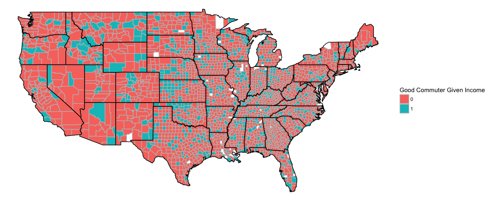
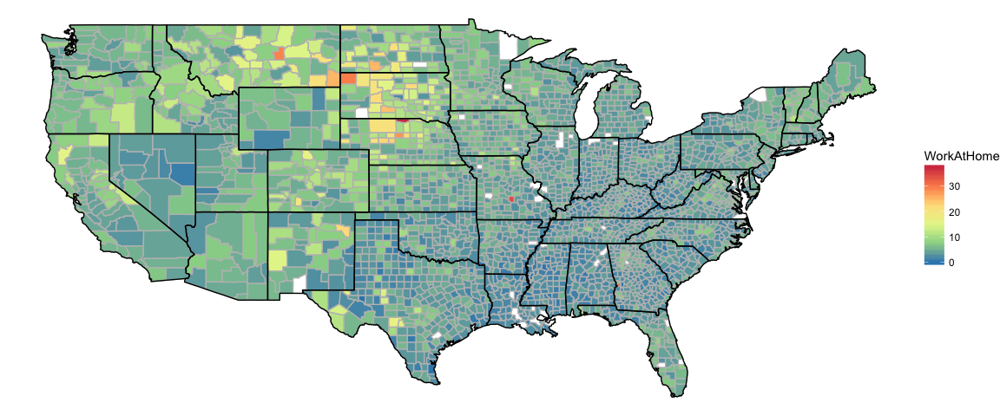
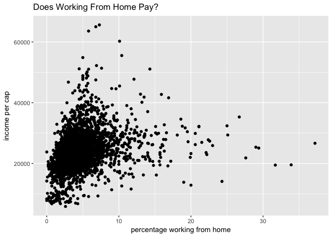
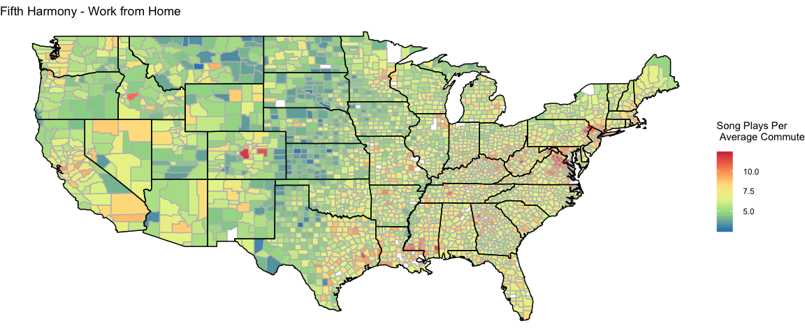

Tidy Tuesday Week 5
================
Sara Stoudt
5/2/2018

Setup
=====

``` r
require(ggplot2)
require(maps)
require(dplyr)
require(plotly)
require(spotifyr)
```

Week 5 - County-level American Community Survey (5-year estimates) 2015
=======================================================================

[RAW DATA](https://github.com/rfordatascience/tidytuesday/blob/master/data/acs2015_county_data.csv)
[DataSource: census.gov](https://factfinder.census.gov/faces/nav/jsf/pages/index.xhtml)
[Kaggle source](https://www.kaggle.com/muonneutrino/us-census-demographic-data)

This week I am taking inspiration from the Tidy Tuesday submissions of @AidoBo and @jakekaupp.

I'm slightly tweaking @AidoBo's function to plot continuous variables on a map to help me explore.

<blockquote class="twitter-tweet" data-lang="en">
<p lang="en" dir="ltr">
For <a href="https://twitter.com/hashtag/TidyTuesday?src=hash&amp;ref_src=twsrc%5Etfw">\#TidyTuesday</a> I created simple function which allows you to plot any continuous variable in the data on a map <a href="https://twitter.com/hashtag/rstats?src=hash&amp;ref_src=twsrc%5Etfw">\#rstats</a> <a href="https://twitter.com/hashtag/r4ds?src=hash&amp;ref_src=twsrc%5Etfw">\#r4ds</a> <a href="https://t.co/6Q1I121VqI">pic.twitter.com/6Q1I121VqI</a>
</p>
— Aidan Boland (@AidoBo) <a href="https://twitter.com/AidoBo/status/991338257391804416?ref_src=twsrc%5Etfw">May 1, 2018</a>
</blockquote>
<script async src="https://platform.twitter.com/widgets.js" charset="utf-8"></script>
And inspired by @jakekaupp's work showing commute time in terms of number of Despacito listens

<blockquote class="twitter-tweet" data-lang="en">
<p lang="en" dir="ltr">
A blog post catching up on week 4 and week 5 of <a href="https://twitter.com/hashtag/TidyTuesday?src=hash&amp;ref_src=twsrc%5Etfw">\#TidyTuesday</a> <a href="https://t.co/AoXuNI5s0j">https://t.co/AoXuNI5s0j</a> Code available at <a href="https://t.co/kuJdBQG4pn">https://t.co/kuJdBQG4pn</a> <a href="https://twitter.com/hashtag/rstats?src=hash&amp;ref_src=twsrc%5Etfw">\#rstats</a> <a href="https://twitter.com/hashtag/r4ds?src=hash&amp;ref_src=twsrc%5Etfw">\#r4ds</a> <a href="https://t.co/IXjONQ0LXs">pic.twitter.com/IXjONQ0LXs</a>
</p>
— Jake Kaupp (@jakekaupp) <a href="https://twitter.com/jakekaupp/status/992128540396138496?ref_src=twsrc%5Etfw">May 3, 2018</a>
</blockquote>
<script async src="https://platform.twitter.com/widgets.js" charset="utf-8"></script>
I wanted to adapt the function from above (thanks @AidoBo) to make a commuting map for any song. We can use the spotifyr package to access the length of a given song.

``` r
counties= map_data("county")
state=map_data("state")

  county_plot <-function(x){
  ## adapted from
  
  ##https://twitter.com/AidoBo/status/991338257391804416
  
  all_county$x<-all_county[,x] ## a different fix for this? something like aes_string?
  
  ggplot(data=counties,mapping=aes(x=long,y=lat,group=group))+
    geom_polygon(data=all_county, aes(fill=x),color="grey")+labs(fill=x)+scale_fill_distiller(palette="Spectral")+theme_void()+
    geom_path(data=state, aes(x=long,y=lat,group=group),color="black") ## add state boundaries
  
}
```

``` r
setwd("~/Desktop/tidytuesday/data")
acs<-read.csv("acs2015_county_data.csv")

head(acs)
```

    ##   CensusId   State  County TotalPop   Men Women Hispanic White Black
    ## 1     1001 Alabama Autauga    55221 26745 28476      2.6  75.8  18.5
    ## 2     1003 Alabama Baldwin   195121 95314 99807      4.5  83.1   9.5
    ## 3     1005 Alabama Barbour    26932 14497 12435      4.6  46.2  46.7
    ## 4     1007 Alabama    Bibb    22604 12073 10531      2.2  74.5  21.4
    ## 5     1009 Alabama  Blount    57710 28512 29198      8.6  87.9   1.5
    ## 6     1011 Alabama Bullock    10678  5660  5018      4.4  22.2  70.7
    ##   Native Asian Pacific Citizen Income IncomeErr IncomePerCap
    ## 1    0.4   1.0       0   40725  51281      2391        24974
    ## 2    0.6   0.7       0  147695  50254      1263        27317
    ## 3    0.2   0.4       0   20714  32964      2973        16824
    ## 4    0.4   0.1       0   17495  38678      3995        18431
    ## 5    0.3   0.1       0   42345  45813      3141        20532
    ## 6    1.2   0.2       0    8057  31938      5884        17580
    ##   IncomePerCapErr Poverty ChildPoverty Professional Service Office
    ## 1            1080    12.9         18.6         33.2    17.0   24.2
    ## 2             711    13.4         19.2         33.1    17.7   27.1
    ## 3             798    26.7         45.3         26.8    16.1   23.1
    ## 4            1618    16.8         27.9         21.5    17.9   17.8
    ## 5             708    16.7         27.2         28.5    14.1   23.9
    ## 6            2055    24.6         38.4         18.8    15.0   19.7
    ##   Construction Production Drive Carpool Transit Walk OtherTransp
    ## 1          8.6       17.1  87.5     8.8     0.1  0.5         1.3
    ## 2         10.8       11.2  84.7     8.8     0.1  1.0         1.4
    ## 3         10.8       23.1  83.8    10.9     0.4  1.8         1.5
    ## 4         19.0       23.7  83.2    13.5     0.5  0.6         1.5
    ## 5         13.5       19.9  84.9    11.2     0.4  0.9         0.4
    ## 6         20.1       26.4  74.9    14.9     0.7  5.0         1.7
    ##   WorkAtHome MeanCommute Employed PrivateWork PublicWork SelfEmployed
    ## 1        1.8        26.5    23986        73.6       20.9          5.5
    ## 2        3.9        26.4    85953        81.5       12.3          5.8
    ## 3        1.6        24.1     8597        71.8       20.8          7.3
    ## 4        0.7        28.8     8294        76.8       16.1          6.7
    ## 5        2.3        34.9    22189        82.0       13.5          4.2
    ## 6        2.8        27.5     3865        79.5       15.1          5.4
    ##   FamilyWork Unemployment
    ## 1        0.0          7.6
    ## 2        0.4          7.5
    ## 3        0.1         17.6
    ## 4        0.4          8.3
    ## 5        0.4          7.7
    ## 6        0.0         18.0

``` r
names(acs)
```

    ##  [1] "CensusId"        "State"           "County"         
    ##  [4] "TotalPop"        "Men"             "Women"          
    ##  [7] "Hispanic"        "White"           "Black"          
    ## [10] "Native"          "Asian"           "Pacific"        
    ## [13] "Citizen"         "Income"          "IncomeErr"      
    ## [16] "IncomePerCap"    "IncomePerCapErr" "Poverty"        
    ## [19] "ChildPoverty"    "Professional"    "Service"        
    ## [22] "Office"          "Construction"    "Production"     
    ## [25] "Drive"           "Carpool"         "Transit"        
    ## [28] "Walk"            "OtherTransp"     "WorkAtHome"     
    ## [31] "MeanCommute"     "Employed"        "PrivateWork"    
    ## [34] "PublicWork"      "SelfEmployed"    "FamilyWork"     
    ## [37] "Unemployment"

``` r
## from @AidoBo too
all_county<-inner_join(counties,acs %>% mutate(County=tolower(County),State=tolower(State)),by=c("subregion"="County","region"="State"))
```

Get your own Client ID and Client Secret [here](https://beta.developer.spotify.com/documentation/web-api/).

``` r
client_id="" ## put yours here
client_secret"" ## put yours here
```

``` r
access_token<-get_spotify_access_token(client_id=client_id,client_secret=client_secret)
```

``` r
county_commute_plot_tunes <-function(artist,song,access_token){
  
  artists <- get_artists(artist,access_token=access_token)
  albums <- get_albums(artists$artist_uri[1],access_token=access_token)
  tracks<-get_album_tracks(albums,access_token=access_token)
  

  track= tracks[which(grepl(song,tracks$track_name)),][1,"track_uri"]
  
  audio_features <- get_track_audio_features(track,access_token=access_token)
  
  songLength=audio_features$duration_ms/1000/60
  
  all_county$commuteTune=all_county$MeanCommute/songLength
  
  ggplot(data=counties,mapping=aes(x=long,y=lat,group=group))+
    geom_polygon(data=all_county, aes(fill=commuteTune),color="grey")+labs(fill=paste("Song Plays Per \n Average Commute"))+scale_fill_distiller(palette="Spectral")+theme_void()+ggtitle(paste(artist,song,sep=" - "))+
    geom_path(data=state, aes(x=long,y=lat,group=group),color="black") ## add state boundaries
  
}
```

Commuting
=========

What are these hot spots?

``` r
p=county_plot("MeanCommute") 
p
```


We can use `ggplotly` to use hover information to identify counties of interest.

``` r
county_plotly <-function(x){
  ## adapted from
  
  ##https://twitter.com/AidoBo/status/991338257391804416
  
  all_county$x<-all_county[,x] ## a different fix for this? something like aes_string?
  
  ggplot(data=counties,mapping=aes(x=long,y=lat,group=group))+
    geom_polygon(data=all_county, aes(fill=x,region=region,subregion=subregion),color="grey")+labs(fill=x)+scale_fill_distiller(palette="Spectral")+theme_void()+
    geom_path(data=state, aes(x=long,y=lat,group=group),color="black") ## add state boundaries
  
}

test=county_plotly("MeanCommute")
ggplotly(test,tooltip=c("region","subregion"))
```

**Must be the money?**

``` r
county_commute_plot_tunes("Nelly","Ride Wit Me",access_token)
```


**Where can commuting make you make more money?**

``` r
p <- ggplot(acs, aes(x = MeanCommute, y = IncomePerCap, text =paste(County,State,sep="-"))) +
  geom_point() +xlab("mean commute")+
  ylab("income per cap")+ggtitle("Where Does/Doesn't Commuting Pay Off?")
p ## static for GitHub
```


``` r
#ggplotly(p)
```

Can we get a rough idea of where it does and doesn't pay to commute on a map instead of relying on hovering?

``` r
## which counties have above average income and below average commute time per state (averages within a state)
averagesByState=group_by(acs,State)%>% summarize(avgMeanCommute=mean(MeanCommute),avgIncomePerCap=mean(IncomePerCap))


acsM=merge(acs,averagesByState,by.x="State",by.y="State",all.x=T)

acs$goodCommuteIncomeLevels=rep(0, nrow(acs))
acs$goodCommuteIncomeLevels[which(acsM$IncomePerCap>acsM$avgIncomePerCap & acsM$MeanCommute < acsM$avgMeanCommute)]=1
acs$goodCommuteIncomeLevels=as.factor(acs$goodCommuteIncomeLevels)

all_county<-inner_join(counties,acs %>% mutate(County=tolower(County),State=tolower(State)),by=c("subregion"="County","region"="State"))

## need a discrete version of the map
ggplot(data=counties,mapping=aes(x=long,y=lat,group=group))+
    geom_polygon(data=all_county, aes(fill=goodCommuteIncomeLevels),color="grey")+labs(fill="Good Commuter Given Income")+scale_fill_discrete()+theme_void()+
    geom_path(data=state, aes(x=long,y=lat,group=group),color="black") ## add state boundaries
```



Work At Home
============

``` r
p=county_plot("WorkAtHome") 
p
```



Again we could use `ggplotly` to identify hot spots?

``` r
test=county_plotly("WorkAtHome")
ggplotly(test,tooltip=c("region","subregion"))
```

A lot could be going on here, so I don't want to read to much into this plot. For example, we don't have income per person, so we don't know if those working from home make more or less than those in other jobs within their county. However, there are some interesting patterns here that it would be interesting to look into with data at the individual level.

``` r
ggplot(acs,aes(x=WorkAtHome,y=acs$IncomePerCap))+geom_point() +xlab("percentage working from home")+
  ylab("income per cap")+ggtitle("Does Working From Home Pay?")
```



``` r
county_commute_plot_tunes("Fifth Harmony","Work from Home",access_token)
```



Note: My `county_commute_plot_tunes` is not robust to capitalization. There was some trial and error involved.
