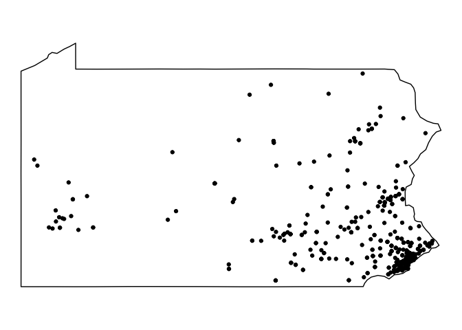
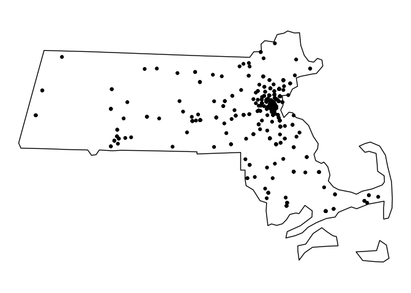
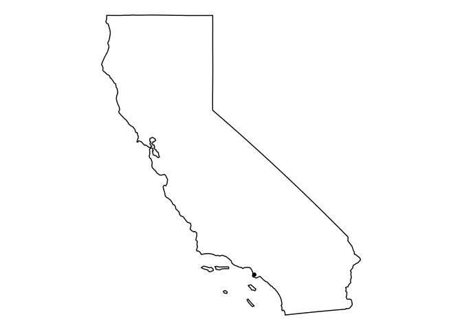

Tidy Tuesday Week 6
================
Sara Stoudt
5/8/2018

Fueled By Dunkin
----------------

### Week 6 - Global coffee-chain locations (as of 2017 or 2018)

[RAW DATA](https://github.com/rfordatascience/tidytuesday/blob/master/data/week6_coffee_chains.xlsx)
[Article](http://flowingdata.com/2014/03/18/coffee-place-geography/)
[DataSource (Starbucks): kaggle.com](https://www.kaggle.com/starbucks/store-locations)
[DataSource (Tim Horton): timhortons.com](https://locations.timhortons.com/)
[DataSource (Dunkin Donuts): odditysoftware.com](http://www.odditysoftware.com/download/download.php?filename=dunkin-donuts.zip)

``` r
require(readxl)
require(dplyr)
require(maps)
require(ggmap)
require(fields)
require(sf)
```

``` r
setwd("~/Desktop/tidytuesday/data")

coffee1=read_excel("week6_coffee_chains.xlsx",sheet=1)
coffee2=read_excel("week6_coffee_chains.xlsx",sheet=2)
coffee3=read_excel("week6_coffee_chains.xlsx",sheet=3)

## all have different columns

starbucksUS=subset(coffee1,Country=="US")
dunkinUS=subset(coffee3,e_country=="USA") ## all in US so not really needed
```

#### How far do I need to walk/drive to get my fix?

I'm putting my personal biases into this, so I"m only looking at Dunkin and Starbucks within the US.

``` r
getMeToCoffee<-function(myPoint,modePrefer,coffeePrefer){
  if(is.character(myPoint)){
    myPoint2=geocode(myPoint,output="latlon")
    
  }

  if(coffeePrefer=="dunkin"){
    toDunkin=rdist(as.matrix(myPoint2),dunkinUS[,c("loc_LONG_centroid","loc_LAT_centroid")])
    closestDunkin=which.min(toDunkin)
    tryThis=paste(dunkinUS$"e_address"[closestDunkin], dunkinUS$e_city[closestDunkin],",",dunkinUS$e_state[closestDunkin],sep=" ")
    test= mapdist(myPoint,tryThis, mode = modePrefer,
                  output = "simple", messaging = FALSE, sensor = FALSE,
                  language = "en-EN", override_limit = FALSE)
    ## does better with character addresses than lat longs
    
  }else if(coffeePrefer=="starbucks"){
    toStarbucks=rdist(myPoint2,starbucksUS[,c("Longitude","Latitude")])
    closestStarbucks=which.min(toStarbucks)
   
    tryThis=paste(starbucksUS[closestStarbucks,"Street Address"], starbucksUS$City[closestStarbucks],",",starbucksUS[closestStarbucks,"State/Province"],sep=" ")
   test= mapdist(myPoint,tryThis, mode = modePrefer,
         output = "simple", messaging = FALSE, sensor = FALSE,
            language = "en-EN", override_limit = FALSE)
  }
  else{
    test=NA
  }
  
  return(test)
  
}
```

``` r
getMeToCoffee("Indiana, PA","driving","dunkin") ## home
```

    ## Information from URL : http://maps.googleapis.com/maps/api/geocode/json?address=Indiana,%20PA&sensor=false

    ## by using this function you are agreeing to the terms at :

    ## http://code.google.com/apis/maps/documentation/distancematrix/

    ## Information from URL : http://maps.googleapis.com/maps/api/distancematrix/json?origins=Indiana+PA&destinations=488+Hyde+Park+Rd+Leechburg++PA&mode=driving&sensor=false

    ##          from                              to     m     km    miles
    ## 1 Indiana, PA 488 Hyde Park Rd Leechburg , PA 45279 45.279 28.13637
    ##   seconds minutes     hours
    ## 1    2562    42.7 0.7116667

``` r
getMeToCoffee("100 Bureau Drive, Gaithersburg MD","driving","dunkin") ## NIST address
```

    ## Information from URL : http://maps.googleapis.com/maps/api/geocode/json?address=100%20Bureau%20Drive,%20Gaithersburg%20MD&sensor=false

    ## by using this function you are agreeing to the terms at :

    ## http://code.google.com/apis/maps/documentation/distancematrix/

    ## Information from URL : http://maps.googleapis.com/maps/api/distancematrix/json?origins=100+Bureau+Drive+Gaithersburg+MD&destinations=16220+Frederick+Rd+Gaithersburg++MD&mode=driving&sensor=false

    ##                                from                                   to
    ## 1 100 Bureau Drive, Gaithersburg MD 16220 Frederick Rd Gaithersburg , MD
    ##      m    km    miles seconds  minutes     hours
    ## 1 5633 5.633 3.500346     418 6.966667 0.1161111

``` r
getMeToCoffee("Smith College, Northampton MA","walking","dunkin") 
```

    ## Information from URL : http://maps.googleapis.com/maps/api/geocode/json?address=Smith%20College,%20Northampton%20MA&sensor=false

    ## by using this function you are agreeing to the terms at :

    ## http://code.google.com/apis/maps/documentation/distancematrix/

    ## Information from URL : http://maps.googleapis.com/maps/api/distancematrix/json?origins=Smith+College+Northampton+MA&destinations=132+King+St+Northampton++MA&mode=walking&sensor=false

    ##                            from                           to   m    km
    ## 1 Smith College, Northampton MA 132 King St Northampton , MA 964 0.964
    ##       miles seconds  minutes     hours
    ## 1 0.5990296     692 11.53333 0.1922222

``` r
getMeToCoffee("Evans Hall, Berkeley CA","driving","dunkin") 
```

    ## Information from URL : http://maps.googleapis.com/maps/api/geocode/json?address=Evans%20Hall,%20Berkeley%20CA&sensor=false

    ## by using this function you are agreeing to the terms at :

    ## http://code.google.com/apis/maps/documentation/distancematrix/

    ## Information from URL : http://maps.googleapis.com/maps/api/distancematrix/json?origins=Evans+Hall+Berkeley+CA&destinations=22510+Crenshaw+Blvd+Torrance++CA&mode=driving&sensor=false

    ##                      from                                to      m      km
    ## 1 Evans Hall, Berkeley CA 22510 Crenshaw Blvd Torrance , CA 622891 622.891
    ##      miles seconds minutes    hours
    ## 1 387.0645   21282   354.7 5.911667

**Note:** We actually do have a Dunkin in good-ole Indiana, PA so all is not lost.

``` r
#map("county","pennsylvania")
#points(coffee3$loc_LONG_centroid,coffee3$loc_LAT_centroid,col="orange")
#https://ryanpeek.github.io/2017-11-05-mapping-with-sf-Part-2/
#https://github.com/tidyverse/ggplot2/issues/2071

paDunkin=subset(coffee3,e_state=="PA")
PA<-us_states( states = "pennsylvania") 
ggplot()+geom_sf(data=PA,color="black",fill=NA)+geom_point(data=paDunkin,aes(x=loc_LONG_centroid,y=loc_LAT_centroid))+theme_void()+theme(panel.grid.major = element_line(colour = "white"))
```



**Plenty**

``` r
#map("county","maryland")
#points(coffee3$loc_LONG_centroid,coffee3$loc_LAT_centroid,col="orange")

mdDunkin=subset(coffee3,e_state=="MD")
MD<-us_states( states = "maryland") 
ggplot()+geom_sf(data=MD,color="black",fill=NA)+geom_point(data=mdDunkin,aes(x=loc_LONG_centroid,y=loc_LAT_centroid))+theme_void()+theme(panel.grid.major = element_line(colour = "white"))
```


**Plenty**

``` r
#map("county","massachusetts")
#points(coffee3$loc_LONG_centroid,coffee3$loc_LAT_centroid,col="orange")

maDunkin=subset(coffee3,e_state=="MA")
MA<-us_states( states = "massachusetts") 
ggplot()+geom_sf(data=MA,color="black",fill=NA)+geom_point(data=maDunkin,aes(x=loc_LONG_centroid,y=loc_LAT_centroid))+theme_void()+theme(panel.grid.major = element_line(colour = "white"))
```



**Book me a plane ticket!**

``` r
#map("county","california")
#points(coffee3$loc_LONG_centroid,coffee3$loc_LAT_centroid,col="orange")

caDunkin=subset(coffee3,e_state=="CA")
CA<-us_states( states = "california") 
ggplot()+geom_sf(data=CA,color="black",fill=NA)+geom_point(data=caDunkin,aes(x=loc_LONG_centroid,y=loc_LAT_centroid))+theme_void()+theme(panel.grid.major = element_line(colour = "white"))
```


