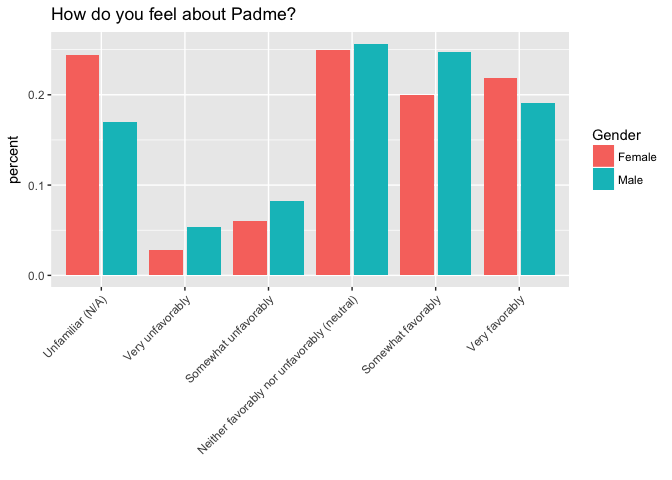
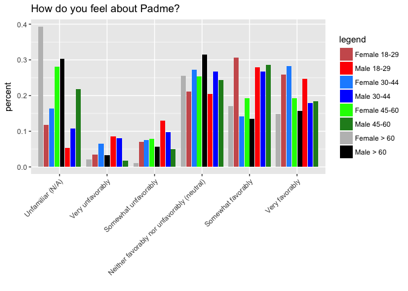
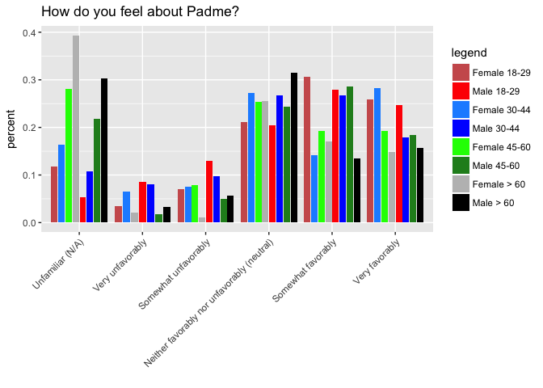
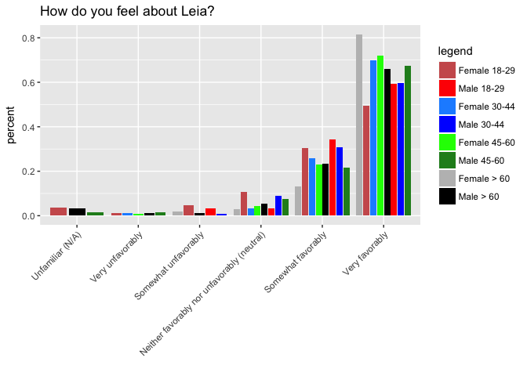

Tidy Tuesday Week 7
================
Sara Stoudt
5/17/2018

### Week 7 - Star Wars Survey (2014)

[RAW DATA](https://github.com/fivethirtyeight/data/blob/master/star-wars-survey/StarWars.csv)
[Article](https://fivethirtyeight.com/features/americas-favorite-star-wars-movies-and-least-favorite-characters/)
[DataSource fivethirtyeight (fivethirtyeight package)](https://github.com/rudeboybert/fivethirtyeight)

### How do perceptions of female Star Wars characters differ across age and gender?

``` r
require(data.table)
require(dplyr)
require(ggplot2)
setwd("~/Desktop/tidytuesday/data")
sw=fread("week7_starwars.csv")
## read.csv didn't work for me
```

Brute force manipulation.

``` r
realHeader=sw[1,]
sw=sw[-1,]

names(sw)[c(36,38)]=c("householdIncome","location")
names(sw)[2]="seenStarWars"
```

Let's focus on those who have actually seen Star Wars.

``` r
swYes=subset(sw,seenStarWars=="Yes")
```

#### Padme

``` r
## complete data only
toPlot=swYes[-which(swYes$Gender==""),c("V28","Gender","Age")]
toPlot=toPlot[-which(toPlot$V28==""),] 

toPlot$V28=factor(toPlot$V28)
toPlot$V28=factor(toPlot$V28,levels=levels(toPlot$V28)[c(4,6,3,1,2,5)]) ## GROSS!

byCatGen=toPlot%>%group_by(V28,Gender)%>%summarise(count=n())

byGen=toPlot%>%group_by(Gender)%>%summarise(count=n())

toPlot=byCatGen%>% inner_join(byGen,by=c("Gender"="Gender"))%>%mutate(percent=count.x/count.y)
```

``` r
ggplot(toPlot,aes(V28,y=percent,fill=Gender))+geom_bar(stat="identity",position = position_dodge2(preserve = "total"))+theme(axis.text.x=element_text(angle=45,hjust=1))+xlab("")+ggtitle("How do you feel about Padme?")
```



``` r
## complete data only
toPlot=swYes[,c("V28","Gender","Age")] 
toPlot=swYes[-which(swYes$Gender==""),c("V28","Gender","Age")]
toPlot=toPlot[-which(toPlot$V28==""),]

## relevel
toPlot$V28=factor(toPlot$V28)
levels(toPlot$V28)
```

    ## [1] "Neither favorably nor unfavorably (neutral)"
    ## [2] "Somewhat favorably"                         
    ## [3] "Somewhat unfavorably"                       
    ## [4] "Unfamiliar (N/A)"                           
    ## [5] "Very favorably"                             
    ## [6] "Very unfavorably"

``` r
toPlot$V28=factor(toPlot$V28,levels=levels(toPlot$V28)[c(4,6,3,1,2,5)]) ## GROSS!


byCatGenAge=toPlot %>%group_by(Gender,Age,V28)%>%summarise(count=n())

byGenAge=toPlot %>%group_by(Gender,Age)%>%summarise(count=n())

toPlot=byCatGenAge %>% inner_join(byGenAge,by=c("Gender"="Gender","Age"="Age")) %>% mutate(percent=count.x/count.y)

## get combo
toPlot$genderAge=paste(toPlot$Gender,toPlot$Age) ## is there a less hacky way to do this?
toPlot$genderAge=as.factor(toPlot$genderAge)

## relevel
levels(toPlot$genderAge)
```

    ## [1] "Female > 60"  "Female 18-29" "Female 30-44" "Female 45-60"
    ## [5] "Male > 60"    "Male 18-29"   "Male 30-44"   "Male 45-60"

``` r
toPlot$genderAge=factor(toPlot$genderAge,levels=levels(toPlot$genderAge)[c(2,6,3,7,4,8,1,5)]) ## GROSS!
```

**HELP PLEASE**

``` r
test=toPlot %>% arrange(genderAge,V28) ### HELP

ggplot(test,aes(V28,y=percent,fill=genderAge))+geom_bar(stat="identity",position = position_dodge2(preserve = "total"))+theme(axis.text.x=element_text(angle=45,hjust=1))+xlab("")+ggtitle("How do you feel about Padme?")+scale_fill_manual("legend",values=c("Female 18-29"="indianred","Male 18-29"="red","Female 30-44"="dodgerblue","Male 30-44" ="blue","Female 45-60"="green", "Male 45-60"="forestgreen","Female > 60" ="grey","Male > 60" ="black"))
```



``` r
## make colors more informative (light and dark of a color for male and female same age), rearrange levels so easier to compare
```

#### Leia

Everyone loves Leia.

``` r
## complete data only
toPlot=swYes[-which(swYes$Gender==""),c("V18","Gender","Age")]
toPlot=toPlot[-which(toPlot$V18==""),]

## relevel
toPlot$V18=factor(toPlot$V18)
toPlot$V18=factor(toPlot$V18,levels=levels(toPlot$V18)[c(4,6,3,1,2,5)]) ## GROSS!

byCatGen=toPlot%>%group_by(V18,Gender)%>%summarise(count=n())

byGen=toPlot%>%group_by(Gender)%>%summarise(count=n())

toPlot=byCatGen%>% inner_join(byGen,by=c("Gender"="Gender"))%>%mutate(percent=count.x/count.y)
```

``` r
ggplot(toPlot,aes(V18,y=percent,fill=Gender))+geom_bar(stat="identity",position = position_dodge2(preserve = "total"))+theme(axis.text.x=element_text(angle=45,hjust=1))+xlab("")+ggtitle("How do you feel about Leia?")
```



``` r
## complete data only
toPlot=swYes[,c("V18","Gender","Age")] 
toPlot=swYes[-which(swYes$Gender==""),c("V18","Gender","Age")]
toPlot=toPlot[-which(toPlot$V18==""),]

byCatGenAge=toPlot %>%group_by(Gender,Age,V18)%>%summarise(count=n())

byGenAge=toPlot %>%group_by(Gender,Age)%>%summarise(count=n())

toPlot=byCatGenAge %>% inner_join(byGenAge,by=c("Gender"="Gender","Age"="Age")) %>% mutate(percent=count.x/count.y)

## get combo
toPlot$genderAge=paste(toPlot$Gender,toPlot$Age) ## is there a less hacky way to do this?
toPlot$genderAge=as.factor(toPlot$genderAge)

## relevel
levels(toPlot$genderAge)
```

    ## [1] "Female > 60"  "Female 18-29" "Female 30-44" "Female 45-60"
    ## [5] "Male > 60"    "Male 18-29"   "Male 30-44"   "Male 45-60"

``` r
toPlot$genderAge=factor(toPlot$genderAge,levels=levels(toPlot$genderAge)[c(2,6,3,7,4,8,1,5)]) ## GROSS!
#toPlot$genderAge=ordered(toPlot$genderAge,levels=levels(toPlot$genderAge)[c(2,6,3,7,4,8,1,5)]) ## GROSS!
toPlot$V18=as.factor(toPlot$V18)
toPlot$V18=factor(toPlot$V18,levels=levels(toPlot$V18)[c(4,6,3,1,2,5)]) ## GROSS!
```

**HELP PLEASE**

``` r
test=toPlot[order(toPlot$genderAge),]

test=toPlot %>% arrange(V18,genderAge)
#test=toPlot %>% arrange(genderAge,V18)


ggplot(test,aes(V18,y=percent,fill=genderAge))+geom_bar(stat="identity",position = position_dodge2(preserve = "total"))+theme(axis.text.x=element_text(angle=45,hjust=1))+xlab("")+ggtitle("How do you feel about Leia?")+scale_fill_manual("legend",values=c("Female 18-29"="indianred","Male 18-29"="red","Female 30-44"="dodgerblue","Male 30-44" ="blue","Female 45-60"="green", "Male 45-60"="forestgreen","Female > 60" ="grey","Male > 60" ="black"))
```



``` r
## make colors more informative (light and dark of a color for male and female same age), rearrange levels so easier to compare
```

#### Challenges

1.  Side by side instead of stacked (`geom_bar` documentation)

2.  [Change barchart colors.](https://stackoverflow.com/questions/38788357/change-bar-plot-colour-in-geom-bar-with-ggplot2-in-r)

3.  [Rotate axis labels.](https://stackoverflow.com/questions/1330989/rotating-and-spacing-axis-labels-in-ggplot2)

4.  Releveling. In haste, I did not do this well. Read [this](https://www.tandfonline.com/doi/abs/10.1080/00031305.2017.1356375) to see why I'm wrong and how I could do better.

5.  Normalizing by the number per category. Letting `stat="count"` was a red herring. It would be nice if there was a way to input values to normalize the fill variable by, but instead I ended up manually calculating the percentages and using `stat="identity"`.

6.  [Correct and consistent ordering of colors (to match the legend)](https://github.com/tidyverse/ggplot2/issues/1472) This still isn't working, and I'm pulling my hair out. PLEASE SEND HELP!
