Tidy Tuesday Week 8
================
Sara Stoudt
5/23/2018

Data: [US Honey Production](https://github.com/rfordatascience/tidytuesday/blob/master/data/week8_honey_production.zip)

Data Source: [USDA](http://usda.mannlib.cornell.edu/MannUsda/viewDocumentInfo.do?documentID=1520)

Data Source:[Kaggle.com](https://www.kaggle.com/jessicali9530/honey-production)

Article: [Bee Culture](http://www.beeculture.com/u-s-honey-industry-report-2016/)

Find my cleaning process for going from the three raw data files to my clean version [here](https://github.com/sastoudt/tidytuesday/blob/master/week8/honey_clean.R).

It's a bit like... 

``` r
require(dplyr)
require(ggplot2)

setwd("~/Desktop/tidytuesday/data/week8_honey_production")
honey=read.csv("honeyDataNice.csv",stringsAsFactors=F)
names(honey)
```

    ## [1] "state"          "numColonies"    "yieldPerColony" "production"    
    ## [5] "stocks"         "avgPricePerLb"  "valProd"        "year"

#### By Year

``` r
byYear=honey %>% group_by(year)%>% summarise(numColoniesT=sum(numColonies),productionT=sum(production),avgPrice=mean(avgPricePerLb),sdPrice=sd(avgPricePerLb),avgYieldPerCol=mean(yieldPerColony),sdYieldPerCol=sd(yieldPerColony),mnumColonies=mean(numColonies),mproduction=mean(production),sdnumColonies=sd(numColonies),sdproduction=sd(production))
```

**Supply and Demand**

``` r
ggplot(byYear,aes(x=year,y=mnumColonies))+geom_point()  ## no real difference, scale is narrow
```

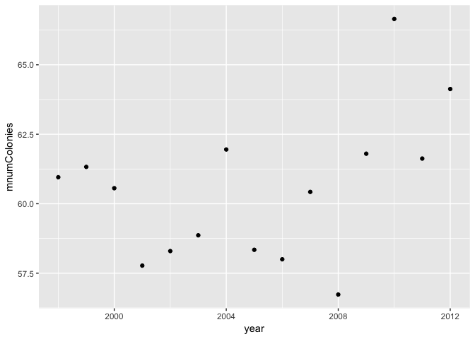

``` r
ggplot(byYear,aes(x=year,y=sdnumColonies))+geom_point() ## increasing variability
```

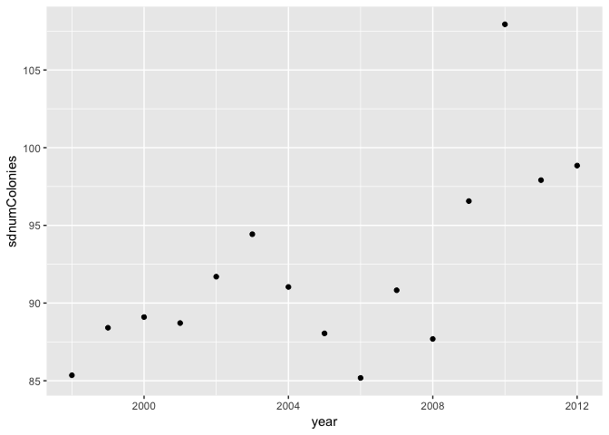

``` r
ggplot(byYear,aes(x=year,y=mproduction))+geom_point()  ## decline
```

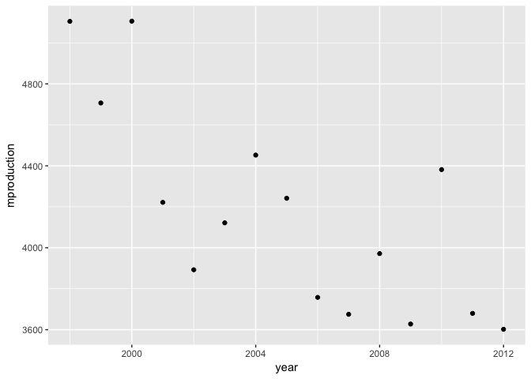

``` r
ggplot(byYear,aes(x=year,y=sdproduction))+geom_point() ## decline
```

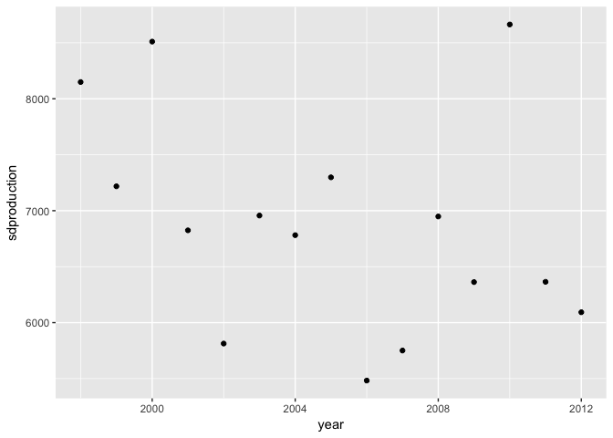

``` r
ggplot(byYear,aes(x=year,avgPrice))+geom_point() ## increase
```

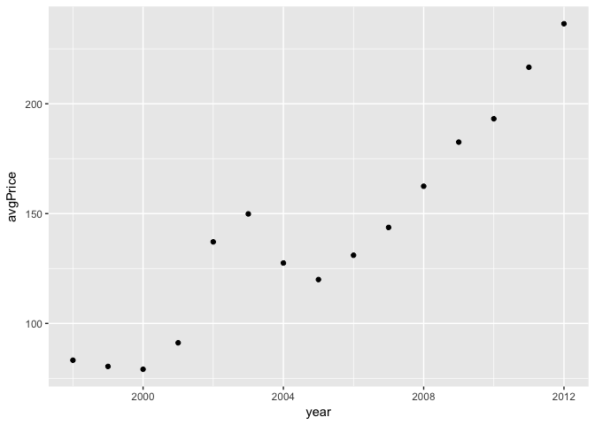

``` r
ggplot(byYear,aes(x=year,sdPrice))+geom_point() ## increase
```

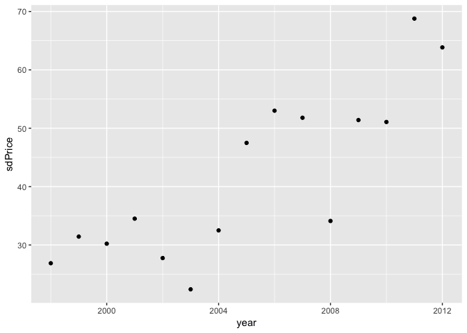

**Efficiency**

``` r
ggplot(byYear,aes(x=year,avgYieldPerCol))+geom_point() ## decline
```

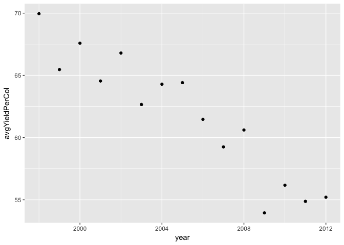

``` r
ggplot(byYear,aes(x=year,sdYieldPerCol))+geom_point() ## decline, but small absolute change
```

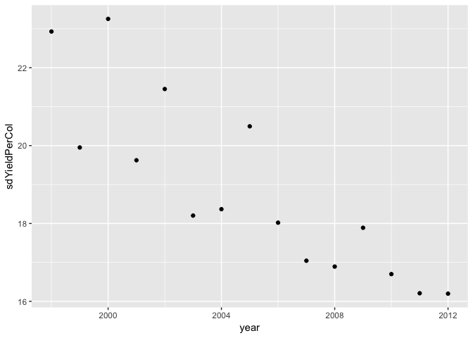

**Take-Aways**

1.  Variability in number of colonies is increasing.
2.  Price is increasing.
3.  Efficiency (yield/colony) is declining.

#### By State

``` r
byState=honey %>% group_by(state)%>% summarise(numColoniesT=sum(numColonies),productionT=sum(production),avgPrice=mean(avgPricePerLb),sdPrice=sd(avgPricePerLb),avgYieldPerCol=mean(yieldPerColony),sdYieldPerCol=sd(yieldPerColony),mnumColonies=mean(numColonies),mproduction=mean(production),sdnumColonies=sd(numColonies),sdproduction=sd(production))

byState %>% arrange(desc(mnumColonies)) %>% head()
```

    ## # A tibble: 6 x 11
    ##   state numColoniesT productionT avgPrice sdPrice avgYieldPerCol
    ##   <chr>        <int>       <int>    <dbl>   <dbl>          <dbl>
    ## 1 CA            6100      347535     113.    42.6           55.8
    ## 2 ND            5555      475085     113.    42.7           88.1
    ## 3 SD            3544      266141     114.    43.1           75.8
    ## 4 FL            2928      247048     110.    41.7           83.1
    ## 5 MT            2040      156562     115.    43.7           77.3
    ## 6 MN            1934      144360     115.    42.8           74.3
    ## # ... with 5 more variables: sdYieldPerCol <dbl>, mnumColonies <dbl>,
    ## #   mproduction <dbl>, sdnumColonies <dbl>, sdproduction <dbl>

``` r
byState %>% arrange(desc(mproduction)) %>% head()
```

    ## # A tibble: 6 x 11
    ##   state numColoniesT productionT avgPrice sdPrice avgYieldPerCol
    ##   <chr>        <int>       <int>    <dbl>   <dbl>          <dbl>
    ## 1 ND            5555      475085     113.    42.7           88.1
    ## 2 CA            6100      347535     113.    42.6           55.8
    ## 3 SD            3544      266141     114.    43.1           75.8
    ## 4 FL            2928      247048     110.    41.7           83.1
    ## 5 MT            2040      156562     115.    43.7           77.3
    ## 6 MN            1934      144360     115.    42.8           74.3
    ## # ... with 5 more variables: sdYieldPerCol <dbl>, mnumColonies <dbl>,
    ## #   mproduction <dbl>, sdnumColonies <dbl>, sdproduction <dbl>

``` r
byState %>% arrange(desc(avgPrice)) %>% head()
```

    ## # A tibble: 6 x 11
    ##   state numColoniesT productionT avgPrice sdPrice avgYieldPerCol
    ##   <chr>        <int>       <int>    <dbl>   <dbl>          <dbl>
    ## 1 VA              99        3998     232.    93.4           40.2
    ## 2 NV             108        4832     222.    76.2           45.2
    ## 3 IL             121        7475     214.    83.8           61.7
    ## 4 KY              66        3445     208.    64.5           52.1
    ## 5 NC             171        8141     207.    67.7           47.8
    ## 6 TN             108        6116     189.    56.1           56.3
    ## # ... with 5 more variables: sdYieldPerCol <dbl>, mnumColonies <dbl>,
    ## #   mproduction <dbl>, sdnumColonies <dbl>, sdproduction <dbl>

``` r
byState %>% arrange(desc(avgYieldPerCol)) %>% head()
```

    ## # A tibble: 6 x 11
    ##   state numColoniesT productionT avgPrice sdPrice avgYieldPerCol
    ##   <chr>        <int>       <int>    <dbl>   <dbl>          <dbl>
    ## 1 HI             131       12647     171.   103.            98.0
    ## 2 LA             565       54410     105.    43.5           95.7
    ## 3 ND            5555      475085     113.    42.7           88.1
    ## 4 MS             252       21853     106.    37.9           87.5
    ## 5 FL            2928      247048     110.    41.7           83.1
    ## 6 WI            1022       81833     127.    43.1           79.4
    ## # ... with 5 more variables: sdYieldPerCol <dbl>, mnumColonies <dbl>,
    ## #   mproduction <dbl>, sdnumColonies <dbl>, sdproduction <dbl>

``` r
require(fiftystater)
data("fifty_states") ## need hawaii
state=map_data("state")

toMatch=cbind.data.frame(abb=state.abb,name=tolower(state.name))

toPlot=inner_join(byState,toMatch,by=c("state"="abb"))

toPlot2=inner_join(fifty_states,toPlot,by=c("id"="name"))

ggplot(data=state,mapping=aes(x=long,y=lat,group=group))+geom_polygon(data=toPlot2,aes(fill=avgPrice))+scale_fill_distiller(palette="Spectral")+theme_void()+
  geom_path(data=state, aes(x=long,y=lat,group=group),color="black") 
```

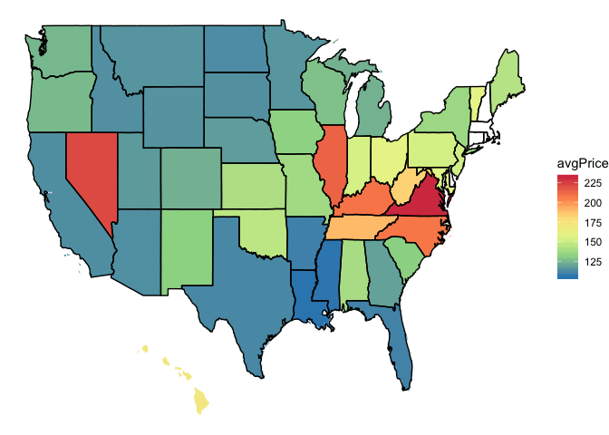

``` r
ggplot(data=state,mapping=aes(x=long,y=lat,group=group))+geom_polygon(data=toPlot2,aes(fill=mnumColonies))+scale_fill_distiller(palette="Spectral")+theme_void()+
  geom_path(data=state, aes(x=long,y=lat,group=group),color="black") 
```

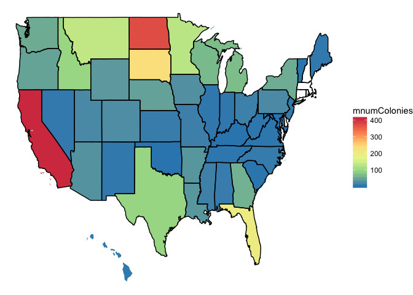

``` r
ggplot(data=state,mapping=aes(x=long,y=lat,group=group))+geom_polygon(data=toPlot2,aes(fill=mproduction))+scale_fill_distiller(palette="Spectral")+theme_void()+
  geom_path(data=state, aes(x=long,y=lat,group=group),color="black") 
```

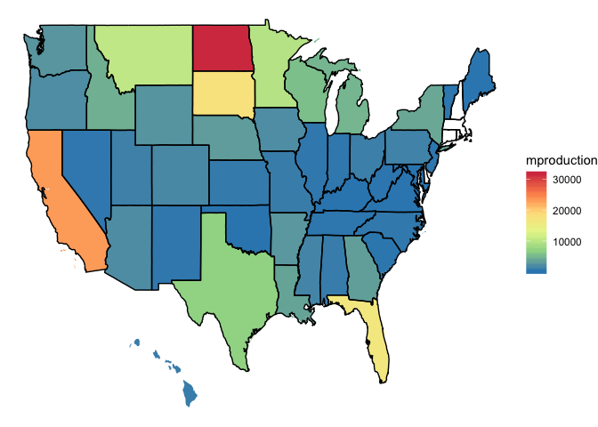

``` r
ggplot(data=state,mapping=aes(x=long,y=lat,group=group))+geom_polygon(data=toPlot2,aes(fill=avgYieldPerCol))+scale_fill_distiller(palette="Spectral")+theme_void()+
  geom_path(data=state, aes(x=long,y=lat,group=group),color="black") 
```

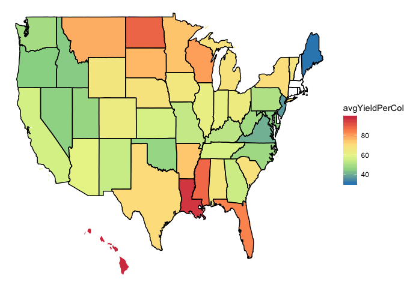

**Take-Aways**

I don't know anything about honey/bees, so maybe these are obvious but I'm surprised by:

1.  the high price in the mid east coast states.
2.  the large number of colonies and production in North Dakota
3.  the high efficiency in Louisiana and North Dakota.

#### By State Over Time

Time for some fancy geofacets!

``` r
require(geofacet)
toMerge=cbind.data.frame(state.abb,state.name)
names(toMerge)=c("abb","name")
toMerge$name=tolower(toMerge$name)

toPlot=merge(honey,toMerge,by.x="state",by.y="abb")

ggplot(toPlot,aes(year,numColonies))+geom_point()+facet_geo(~state)
```

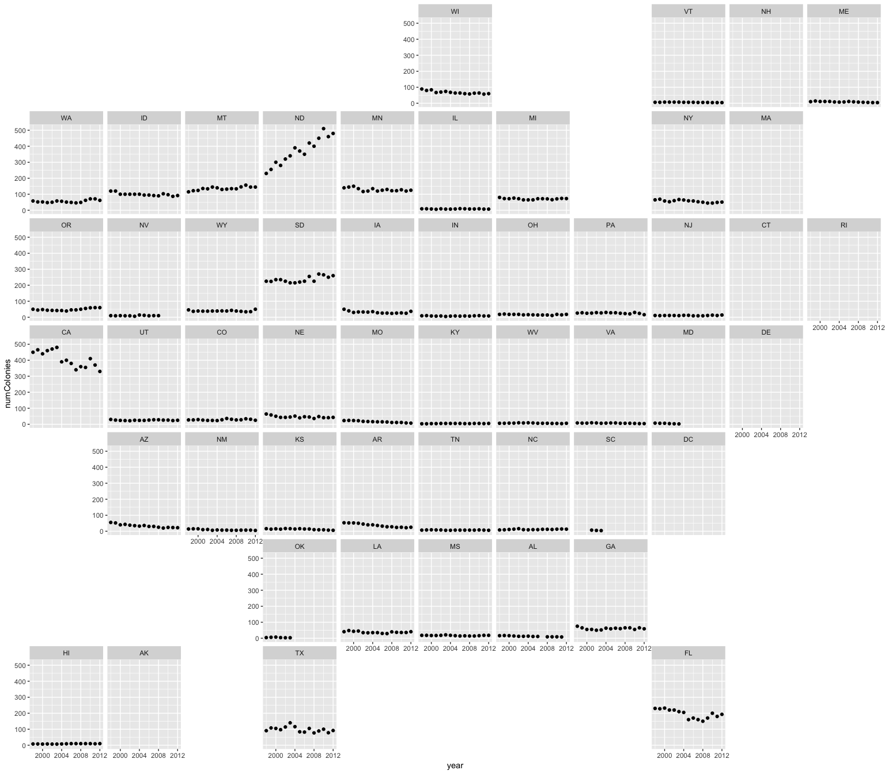

``` r
ggplot(toPlot,aes(year,yieldPerColony))+geom_point()+facet_geo(~state)
```

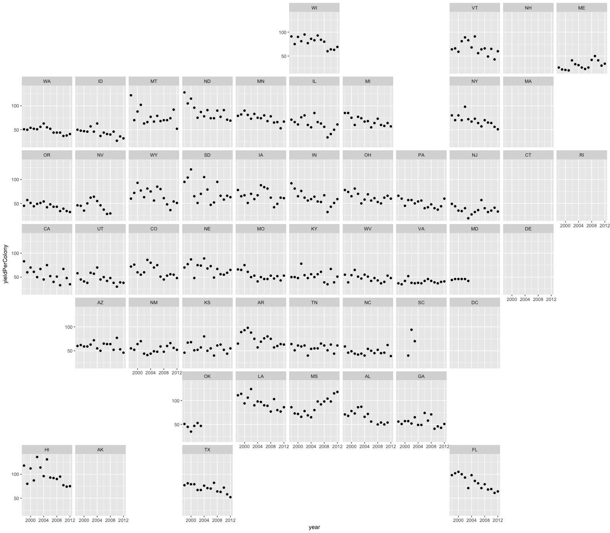

``` r
ggplot(toPlot,aes(year,production))+geom_point()+facet_geo(~state)
```


``` r
ggplot(toPlot,aes(year,avgPricePerLb))+geom_point()+facet_geo(~state)
```


**Take-Aways**

1.  Number of Colonies and Production: North Dakota is on the rise; California is on the decline.
2.  Louisiana's high efficiency is on the decline while Mississippi's is on the rise. Florida and Hawaii are also suffering.
3.  Price increases are fairly similar across all of the states.
