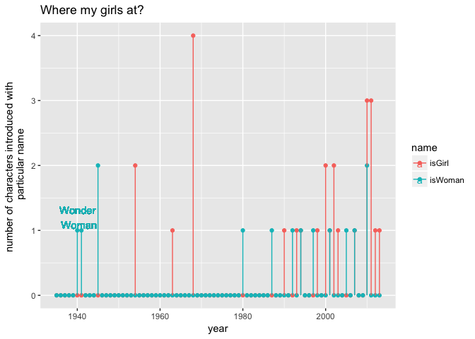
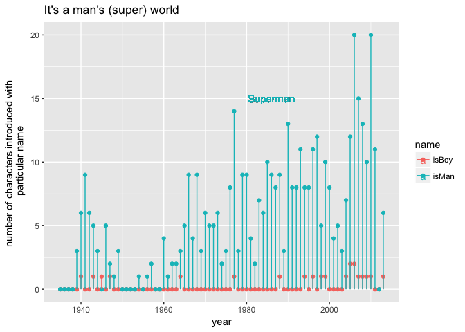
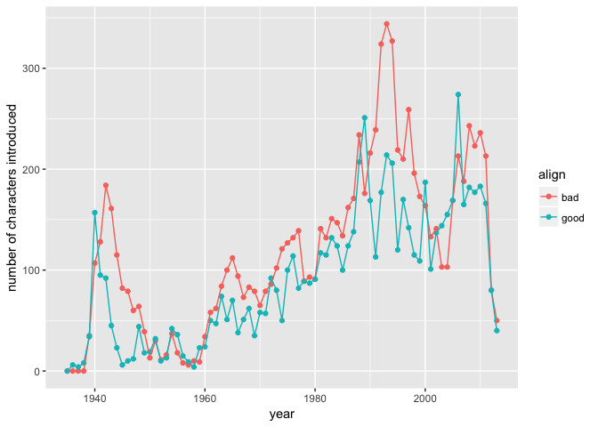
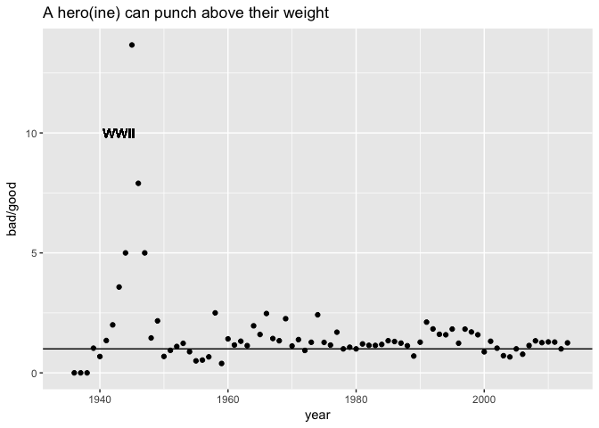
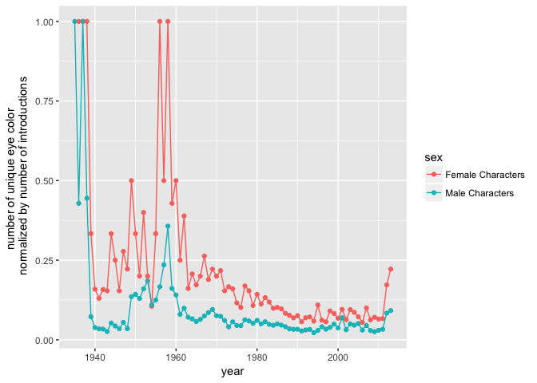
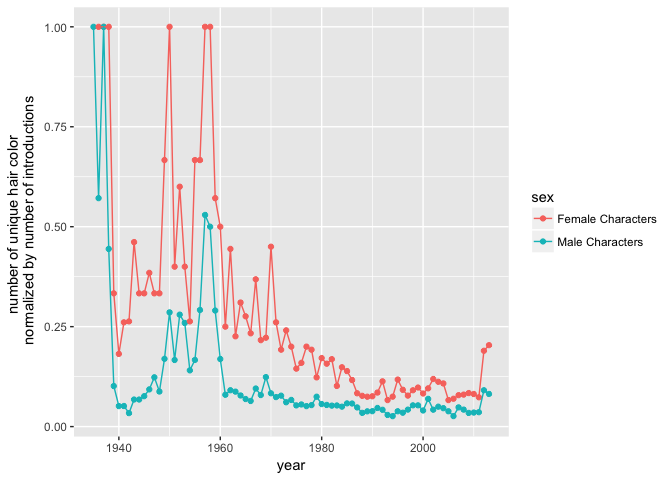
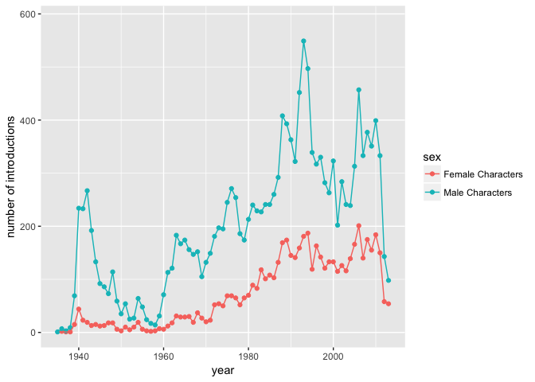
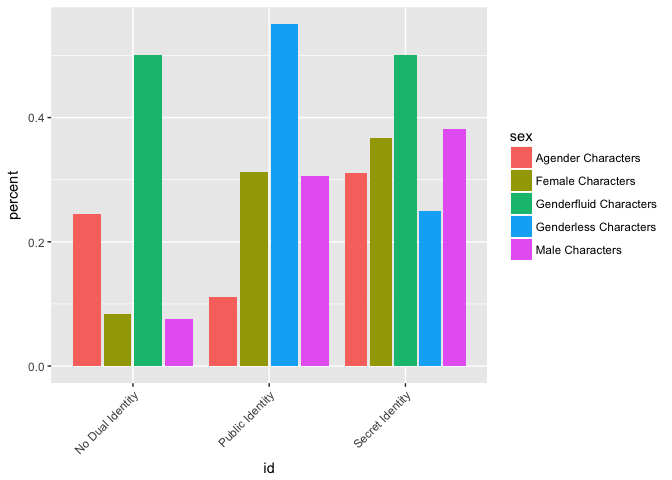

Tidy Tuesday Week 9
================
Sara Stoudt
5/31/2018

Data: [Comic book characters](https://github.com/rfordatascience/tidytuesday/blob/master/data/week9_comic_characters.csv)

Data Source: [FiveThirtyEight package](https://github.com/rudeboybert/fivethirtyeight)

Article: [FiveThirtyEight.com](https://fivethirtyeight.com/features/women-in-comic-books/)

``` r
require(dplyr)
require(ggplot2)
require(tidyr)

setwd("~/Desktop/tidytuesday/data")
cb=read.csv("week9_comic_characters.csv")
```

#### Names: Boy v. Man, Girl v. Woman

``` r
cb$isBoy=unlist(lapply(cb$name,function(x){grepl("boy\\>",x,ignore.case=T)})) ## nothing after boy

cb$isGirl=unlist(lapply(cb$name,function(x){grepl("girl",x,ignore.case=T)}))## 

cb$isMan=unlist(lapply(cb$name,function(x){grepl("man\\>",x,ignore.case=T)})) ## nothing after man

cb$isWoman=unlist(lapply(cb$name,function(x){grepl("woman",x,ignore.case=T)}))## 

cb$isMan[which(cb$isMan==1 & cb$isWoman==1)]=0 ## don't want to double count woman

byYear=cb %>% group_by(year)%>%summarise(isGirl=sum(isGirl),count=n(),isWoman=sum(isWoman),isBoy=sum(isBoy),isMan=sum(isMan)) %>% mutate(percentG=isGirl/count,percentW=isWoman/count)
```

**Tangent**: Just for the record: characters identified as another's girlfriend exist, but no boyfriends.

``` r
gf=cb[which(unlist(lapply(cb$name,function(x){grepl("girlfriend",x,ignore.case=T)}))==T),]
gf$name
```

    ## [1] Ruby (Thug's girlfriend) (Earth-616)     
    ## [2] Annie (Noh-Varr's Girlfriend) (Earth-616)
    ## [3] Karen (Hijack's girlfriend) (Earth-616)  
    ## 23272 Levels: 'Spinner (Earth-616) ...

``` r
bf=cb[which(unlist(lapply(cb$name,function(x){grepl("boyfriend",x,ignore.case=T)}))==T),]
nrow(bf)
```

    ## [1] 0

``` r
sub=byYear[,c("year","isGirl","isWoman")]
toPlotUpdated=sub %>%gather(name, value, -year)

ggplot(toPlotUpdated,aes(x=year,y=value,col=name))+geom_point()+geom_segment(aes(x=year,y=0,xend=year,yend=value,col=name))+ylab("number of characters introduced with \n particular name")+ggtitle("Where my girls at?")+geom_text(aes(x=1940.1,y=1.2,label="Wonder\n Woman"))
```



``` r
sub=byYear[,c("year","isBoy","isMan")]
toPlotUpdated=sub %>%gather(name, value, -year)

ggplot(toPlotUpdated,aes(x=year,y=value,col=name))+geom_point()+geom_segment(aes(x=year,y=0,xend=year,yend=value,col=name))+ylab("number of characters introduced with \n particular name")+ggtitle("It's a man's (super) world")+geom_text(aes(x=1986,y=15,label="Superman"))
```



**Take-Away**: There are way more "men" than "boys" but "girl" is pervasive even after the Wonder Woman precedent.

#### Good v. Bad

``` r
toPlot2=cb %>% group_by(year)%>% summarise(bad=length(which(align=="Bad Characters")),good=length(which(align=="Good Characters")))

toPlot2Update=gather(toPlot2,align,count,-year)

ggplot(toPlot2Update,aes(x=year,y=count,col=align,group=align))+geom_point()+geom_line()+ylab("number of characters introduced")
```



``` r
ggplot(toPlot2,aes(x=year,y=bad/good))+geom_point()+geom_hline(yintercept=1)+geom_text(aes(x=1943,y=10,label="WWII"))+ggtitle("A hero(ine) can punch above their weight")
```



**Take-Away**: More bad than good characters are introduced over time fairly consistently. Interestingly, there is a peak in bad characters during World War II. Overall, it looks like each hero can handle more than one villain.

#### Appearance Variability

``` r
toPlot=cb %>%group_by(year,sex)%>% summarise(count=n(),uniqueEye=length(unique(eye))/n(),uniqueHair=length(unique(hair))/n())%>%filter(!is.na(sex)) %>% filter(sex %in% c("Male Characters","Female Characters"))

ggplot(toPlot,aes(x=year,y=uniqueEye,col=sex,group=sex))+geom_point()+geom_line()+ylab("number of unique eye color \n normalized by number of introductions")
```



``` r
ggplot(toPlot,aes(x=year,y=uniqueHair,col=sex,group=sex))+geom_point()+geom_line()+ylab("number of unique hair color \n normalized by number of introductions")
```



``` r
ggplot(toPlot,aes(x=year,y=count,col=sex,group=sex))+geom_point()+geom_line()+ylab("number of introductions")
```



**Take-Away:** There is (proportionally) more variability in hair and eye color for female characters. There is a decline in variability in hair and eye color over time, but at least part of this is due to the rise in new characters (and a limit on the number of hair/eye colors).

#### Identity by Sex

``` r
bySex=cb %>%group_by(sex)%>% summarise(count=n())

bySexID=cb %>% group_by(sex,id)%>% summarise(count=n()) %>%inner_join(bySex,by=c("sex"="sex"))%>% mutate(percent=count.x/count.y)

toPlot=bySexID %>% filter(id %in% c("Public Identity","Secret Identity","No Dual Identity"))%>% filter(!is.na(sex))

toPlot2=as.data.frame(toPlot%>%arrange(sex))

ggplot(toPlot2,aes(id,y=percent,fill=sex))+geom_bar(stat="identity",position = position_dodge2(preserve = "total"))+theme(axis.text.x=element_text(angle=45,hjust=1))
```



**Take-Away**: There doesn't seem to be any real difference between female and men in terms of identity. I am reluctant to make any claims about the other categories because of their small sample size.
